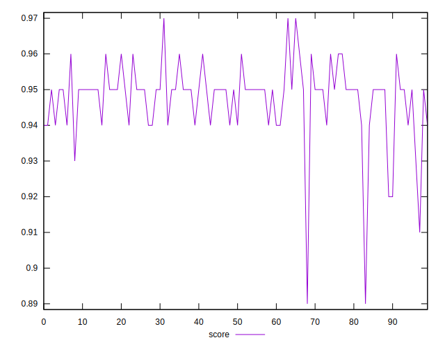
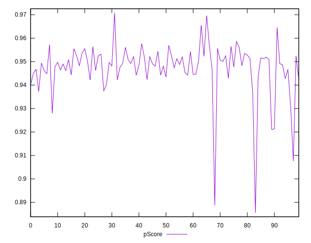
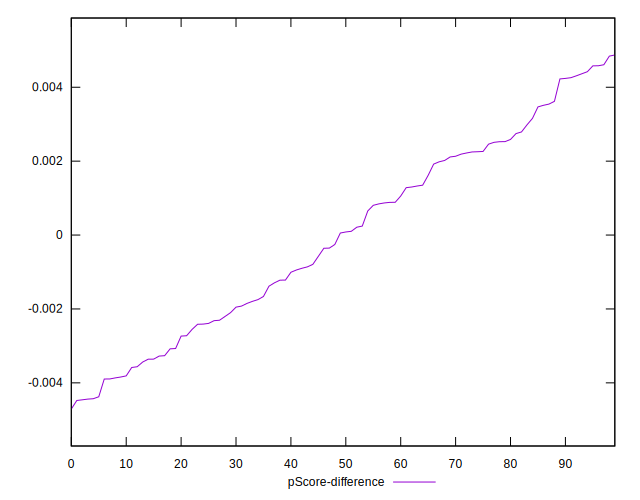

# //mainthread-work-breakdown/samples/pages+cached+noadtech

[→ Parent](../..)


## Raw


```yaml
p90min: 1583.1800000000007
p90max: 1833.2680000000005
p90range: 250.08799999999974
p90mean: 1671.5185934065942
p90median: 1668.8560000000014
p90stdev: 46.931861552581985
p90skewness: 0.7064986866599988
p90eccentricity: 0.9999999999999997
p90discretization: 1
outlandishness: 1.0100012070389608
confidence: 36.37744036798267
p90confidence: 19.285245481860784

```


## Score


```yaml
p90min: 0.93
p90max: 0.96
p90range: 0.029999999999999916
p90mean: 0.9489010989010994
p90median: 0.95
p90stdev: 0.006367939865692497
p90skewness: -0.1580552094166417
p90eccentricity: 0.9999999999999993
p90discretization: 22.75
outlandishness: 0.996417805565679
confidence: 0.004835354688776494
p90confidence: 0.0026167145188991103

```


## Raw Estimate


## Score Estimate


## P Score


```yaml
p90min: 0.9308045214152417
p90max: 0.9645794836495081
p90range: 0.03377496223426635
p90mean: 0.949032288022007
p90median: 0.9491387678105938
p90stdev: 0.0054500917762561355
p90skewness: -0.36039088393818447
p90eccentricity: 1.0000000000000004
p90discretization: 1
outlandishness: 0.9961467365537358
confidence: 0.004787335837152851
p90confidence: 0.0022395522855194194

```


## Score Difference


```yaml
p90min: 0
p90max: 1.1102230246251565e-16
p90range: 1.1102230246251565e-16
p90mean: 9.394194823751324e-17
p90median: 1.1102230246251565e-16
p90stdev: 4.005698132015893e-17
p90skewness: -1.9188064472005035
p90eccentricity: 1.000000000000003
p90discretization: 45.5
outlandishness: 0.8281000000000001
confidence: 1.8314606713280832e-17
p90confidence: 1.64602189741839e-17

```


## P Score Difference


```yaml
p90min: -0.004429476812366717
p90max: 0.004421024897485415
p90range: 0.008850501709852132
p90mean: -0.00005706026954647987
p90median: 0.000054605130955120984
p90stdev: 0.0025484952090035593
p90skewness: 0.043882485678863645
p90eccentricity: 1.0000000000000009
p90discretization: 1
outlandishness: 0.001338458190106333
confidence: 0.0010972699963714152
p90confidence: 0.0010472279191379346

```

