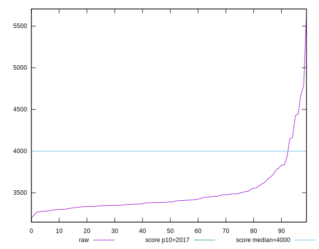
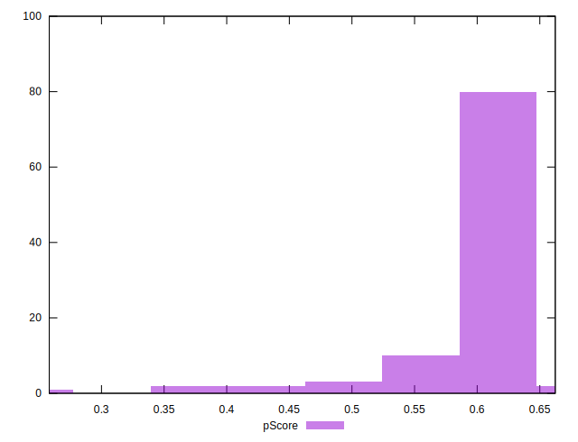
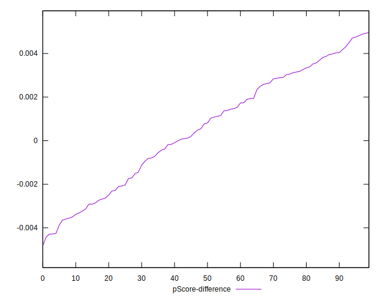

# //mainthread-work-breakdown/samples/pages+cached

[→ Parent](../..)


## Raw


```yaml
p90min: 3197.9680000000003
p90max: 3832.3600000000015
p90range: 634.3920000000012
p90mean: 3413.9752967032978
p90median: 3383.203999999997
p90stdev: 121.09535392340602
p90skewness: 1.4009121316775688
p90eccentricity: 1.0000000000000007
p90discretization: 1
outlandishness: 1.055477825664559
confidence: 139.16770065990204
p90confidence: 49.760515561676584

```


## Score


```yaml
p90min: 0.53
p90max: 0.66
p90range: 0.13
p90mean: 0.6163736263736267
p90median: 0.62
p90stdev: 0.025311964921121713
p90skewness: -1.3866458230558594
p90eccentricity: 0.9999999999999997
p90discretization: 6.5
outlandishness: 0.9450515832153583
confidence: 0.025134534121044716
p90confidence: 0.0104011952857479

```


## Raw Estimate


## Score Estimate


## P Score


```yaml
p90min: 0.5319355326061326
p90max: 0.6623394773443665
p90range: 0.1304039447382339
p90mean: 0.6168001400333797
p90median: 0.6230355358010519
p90stdev: 0.02500005355039498
p90skewness: -1.342196997000439
p90eccentricity: 1.0000000000000002
p90discretization: 1
outlandishness: 0.9454676054936753
confidence: 0.025007661277585136
p90confidence: 0.010273024632506011

```


## Score Difference


```yaml
p90min: 0
p90max: 0
p90range: 0
p90mean: 0
p90median: 0
p90stdev: 0
p90skewness: .nan
p90eccentricity: .nan
p90discretization: 91
outlandishness: .inf
confidence: 5.258534703630931e-18
p90confidence: 0

```


## P Score Difference


```yaml
p90min: -0.0036375753054916915
p90max: 0.004817086476172183
p90range: 0.008454661781663875
p90mean: 0.0007234034297484026
p90median: 0.0010318252086772839
p90stdev: 0.002515182205248869
p90skewness: -0.1743252671127626
p90eccentricity: 1.0000000000000002
p90discretization: 1
outlandishness: 0.570911225583835
confidence: 0.001094026497677253
p90confidence: 0.001033538936133765

```

