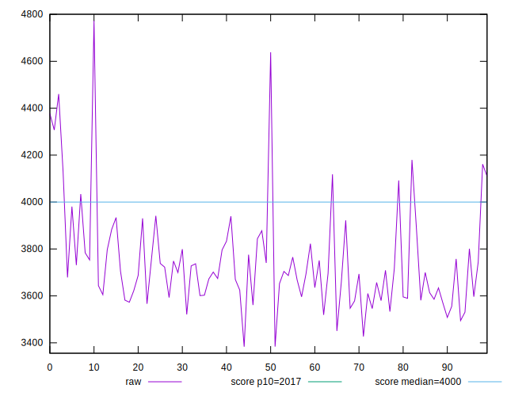
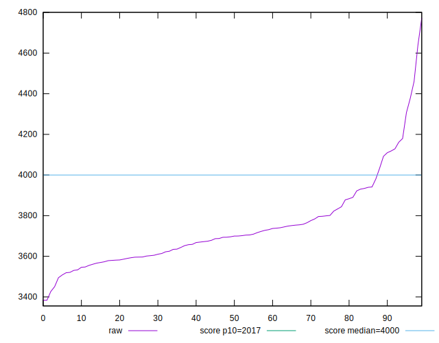
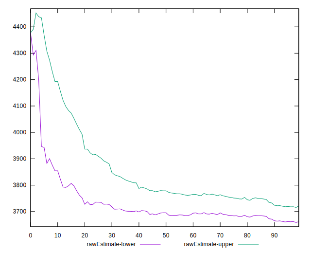
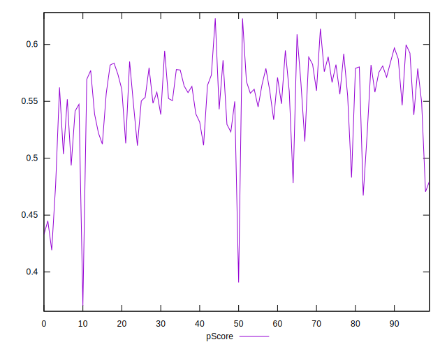

# //mainthread-work-breakdown/samples/pages

[→ Parent](../..)


## Raw


```yaml
p90min: 3383.4239999999954
p90max: 4109.795999999998
p90range: 726.3720000000021
p90mean: 3691.504659340657
p90median: 3686.783999999996
p90stdev: 144.14379666871122
p90skewness: 0.5744610770181418
p90eccentricity: 1.0000000000000002
p90discretization: 1
outlandishness: 1.0323351930578597
confidence: 95.04585506580679
p90confidence: 59.23158407703522

```


## Score


```yaml
p90min: 0.48
p90max: 0.61
p90range: 0.13
p90mean: 0.5567032967032965
p90median: 0.56
p90stdev: 0.029799879970808657
p90skewness: -0.83030687819039
p90eccentricity: 1.0000000000000004
p90discretization: 6.5
outlandishness: 0.9721625237781146
confidence: 0.017911068434079525
p90confidence: 0.012245369809658069

```


## Raw Estimate


## Score Estimate


## P Score


```yaml
p90min: 0.47634126484154143
p90max: 0.6138796967205405
p90range: 0.1375384318789991
p90mean: 0.5569168348200837
p90median: 0.5593008863136616
p90stdev: 0.02947813724055603
p90skewness: -0.8111505223561765
p90eccentricity: 1.0000000000000002
p90discretization: 1
outlandishness: 0.972530558611218
confidence: 0.017816617940266566
p90confidence: 0.012113159253126504

```


## Score Difference


```yaml
p90min: 0
p90max: 5.551115123125783e-17
p90range: 5.551115123125783e-17
p90mean: 6.100126508929432e-19
p90median: 0
p90stdev: 5.787088135016532e-18
p90skewness: 9.381423725166234
p90eccentricity: 1.0000000000000029
p90discretization: 45.5
outlandishness: 268.3044
confidence: 1.2068449747603987e-17
p90confidence: 2.3780308646806364e-18

```


## P Score Difference


```yaml
p90min: -0.0038005089526220726
p90max: 0.00448806238502808
p90range: 0.008288571337650152
p90mean: 0.0003808113709016462
p90median: 0.0004752334743562958
p90stdev: 0.002366344336459694
p90skewness: -0.0030156683943829065
p90eccentricity: 1.0000000000000007
p90discretization: 1
outlandishness: 0.6819473954897526
confidence: 0.0010407864245470379
p90confidence: 0.0009723784634476279

```

