# //max-potential-fid/samples/pages+cached+noadtech+nomedia+nocss

[→ Parent](../..)


## Raw


```yaml
p90min: 41
p90max: 69
p90range: 28
p90mean: 52.26923076923077
p90median: 51.5
p90stdev: 6.219566648762111
p90skewness: 0.6714858454912219
p90eccentricity: 1.0000000000000004
p90discretization: 1.8958333333333333
outlandishness: 1.0939713042691976
confidence: 4.455737481192031
p90confidence: 2.5557449810037127

```

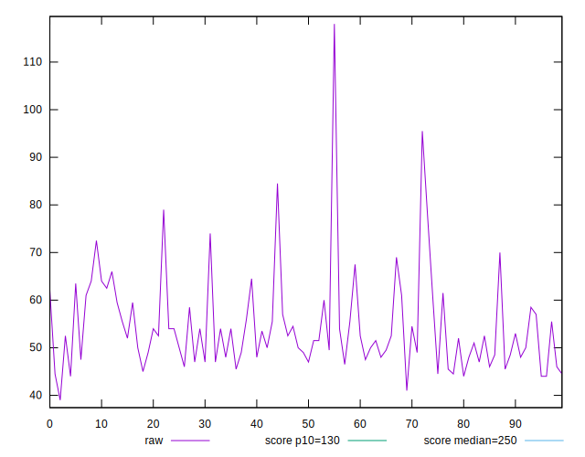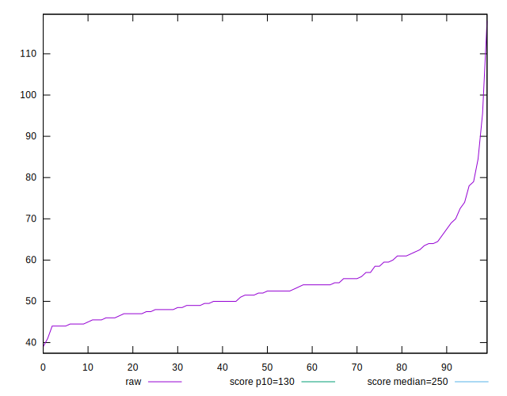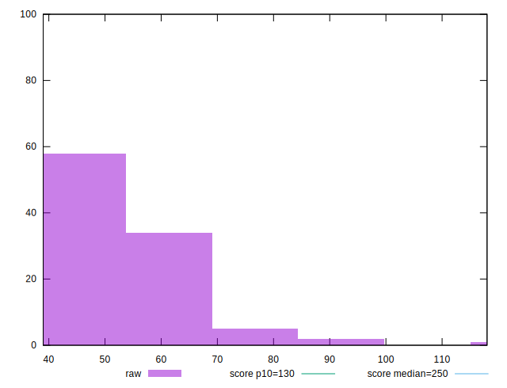
## Score


```yaml
p90min: 0.99
p90max: 1
p90range: 0.010000000000000009
p90mean: 0.9998901098901098
p90median: 1
p90stdev: 0.0010425091187368318
p90skewness: -9.381423725166322
p90eccentricity: 0.999999999999995
p90discretization: 45.5
outlandishness: 0.996422591943615
confidence: 0.003169813825985246
p90confidence: 0.0004283879566420179

```

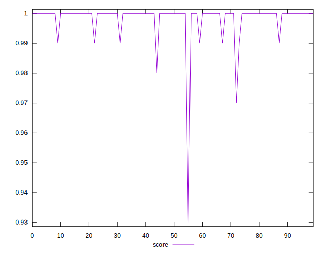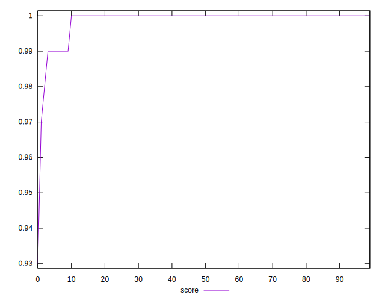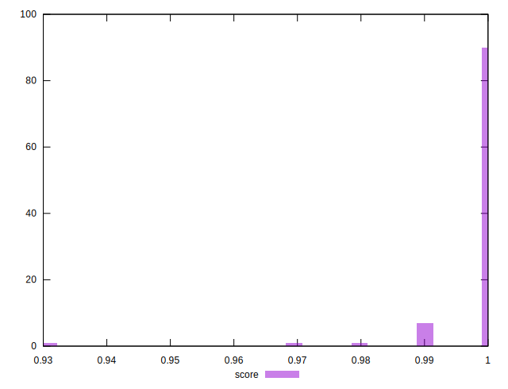
## Raw Estimate

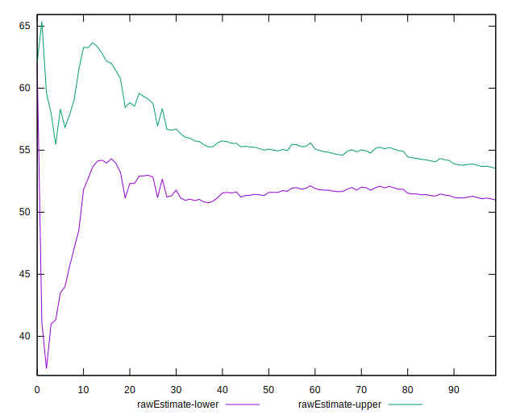
## Score Estimate

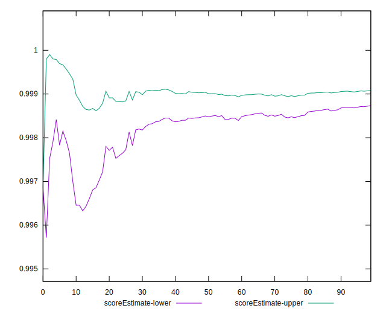
## P Score


```yaml
p90min: 0.994856095439541
p90max: 0.9998642134028825
p90range: 0.005008117963341441
p90mean: 0.9987071372941875
p90median: 0.999019888943648
p90stdev: 0.0010589930525529928
p90skewness: -1.5712845071890893
p90eccentricity: 1.0000000000000002
p90discretization: 2.1666666666666665
outlandishness: 0.9968612937995888
confidence: 0.0030498597708594755
p90confidence: 0.00043516153645839495

```

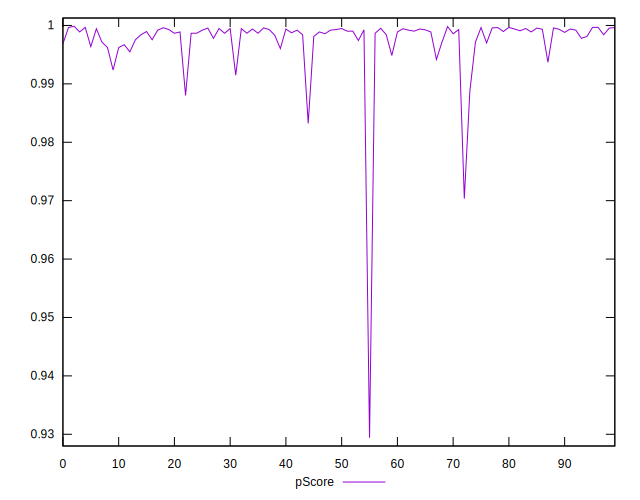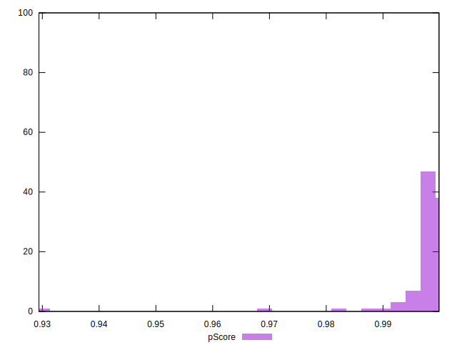
## Score Difference


```yaml
p90min: 0
p90max: 0
p90range: 0
p90mean: 0
p90median: 0
p90stdev: 0
p90skewness: .nan
p90eccentricity: .nan
p90discretization: 91
outlandishness: .nan
confidence: 0
p90confidence: 0

```


## P Score Difference


```yaml
p90min: -0.003618703171822224
p90max: 0.0014796308990092655
p90range: 0.0050983340708314895
p90mean: -0.0010814715787922113
p90median: -0.000804916819314494
p90stdev: 0.0008416058721287319
p90skewness: -0.8242540584245059
p90eccentricity: 1.0000000000000002
p90discretization: 2.116279069767442
outlandishness: 0.7903052018972088
confidence: 0.0005736950182609907
p90confidence: 0.0003458327734303414

```

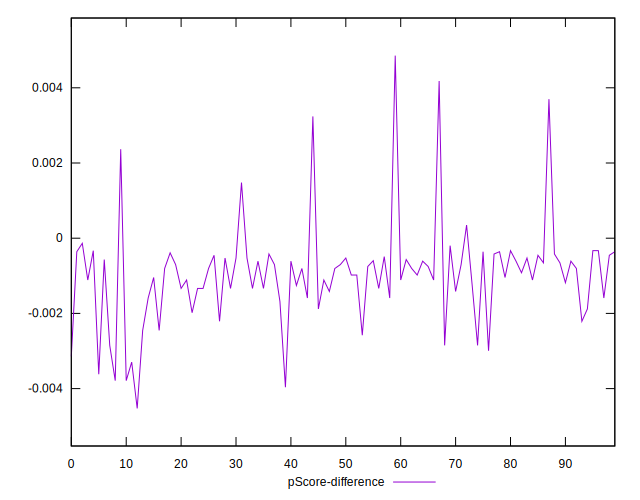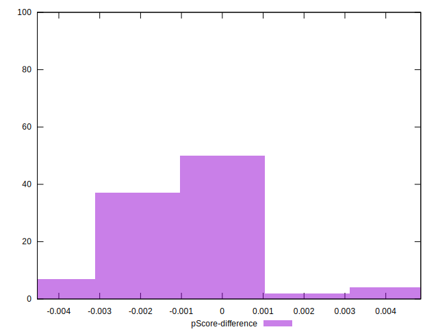