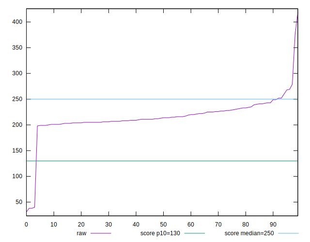
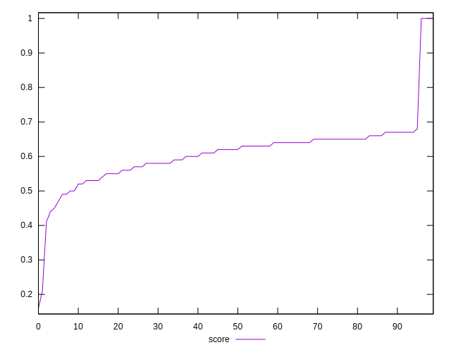
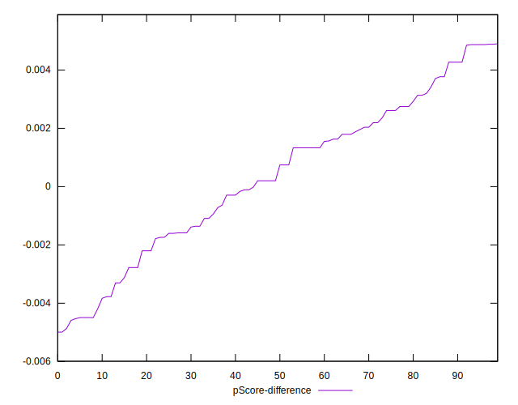

# //max-potential-fid/samples/pages+cached+noadtech+nomedia

[→ Parent](../..)


## Raw


```yaml
p90min: 198
p90max: 260
p90range: 62
p90mean: 217.46153846153845
p90median: 212.99999999999977
p90stdev: 14.796277889772753
p90skewness: 0.8479931613691513
p90eccentricity: 0.9999999999999997
p90discretization: 1.4
outlandishness: 0.981585387270082
confidence: 18.561707473051
p90confidence: 6.080088065596897

```


## Score


```yaml
p90min: 0.47
p90max: 0.68
p90range: 0.21000000000000008
p90mean: 0.6082417582417581
p90median: 0.62
p90stdev: 0.050548494974245586
p90skewness: -0.7933855864946527
p90eccentricity: 1.0000000000000009
p90discretization: 4.55
outlandishness: 1.0064493896490185
confidence: 0.04466303382077763
p90confidence: 0.02077139286760943

```


## Raw Estimate


## Score Estimate


## P Score


```yaml
p90min: 0.4693658233953647
p90max: 0.6761675307336696
p90range: 0.20680170733830494
p90mean: 0.6085651780148945
p90median: 0.6231996918651281
p90stdev: 0.05026604772535514
p90skewness: -0.7835968226451986
p90eccentricity: 1.0000000000000002
p90discretization: 1.4
outlandishness: 1.0064644772014606
confidence: 0.044585986992935256
p90confidence: 0.020655329614409412

```


## Score Difference


```yaml
p90min: 0
p90max: 0
p90range: 0
p90mean: 0
p90median: 0
p90stdev: 0
p90skewness: .nan
p90eccentricity: .nan
p90discretization: 91
outlandishness: .inf
confidence: 7.95355978481141e-18
p90confidence: 0

```


## P Score Difference


```yaml
p90min: -0.004190473197448086
p90max: 0.004902014345056216
p90range: 0.009092487542504302
p90mean: 0.0008224965949446898
p90median: 0.001332299645305901
p90stdev: 0.002489284745646264
p90skewness: -0.0987381920516359
p90eccentricity: 0.9999999999999997
p90discretization: 1.378787878787879
outlandishness: 0.16003746712332115
confidence: 0.00111596613351732
p90confidence: 0.0010228971493119645

```

