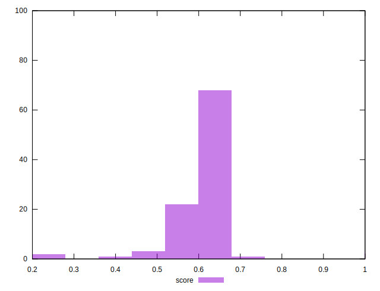

# //max-potential-fid/samples/pages+cached+noadtech

[→ Parent](../..)


## Raw


```yaml
p90min: 198
p90max: 242
p90range: 44
p90mean: 214.94505494505495
p90median: 215
p90stdev: 9.288256365737452
p90skewness: 0.524209093572576
p90eccentricity: 1.0000000000000009
p90discretization: 1.6545454545454545
outlandishness: 0.9967919430957548
confidence: 16.042709293798737
p90confidence: 3.8167312820313555

```


## Score


```yaml
p90min: 0.53
p90max: 0.68
p90range: 0.15000000000000002
p90mean: 0.6175824175824177
p90median: 0.62
p90stdev: 0.03238981861942503
p90skewness: -0.4793707078804102
p90eccentricity: 0.9999999999999992
p90discretization: 5.6875
outlandishness: 0.9900427047054873
confidence: 0.03848872256940039
p90confidence: 0.01330962767135735

```


## Raw Estimate


## Score Estimate


## P Score


```yaml
p90min: 0.5254107572246296
p90max: 0.6761675307336696
p90range: 0.15075677350904004
p90mean: 0.6167212766185785
p90median: 0.6162243471391701
p90stdev: 0.03209389209145463
p90skewness: -0.4721919571407212
p90eccentricity: 0.9999999999999999
p90discretization: 1.6545454545454545
outlandishness: 0.9905755228891692
confidence: 0.038394042031570486
p90confidence: 0.013188025511381207

```


## Score Difference


```yaml
p90min: 0
p90max: 0
p90range: 0
p90mean: 0
p90median: 0
p90stdev: 0
p90skewness: .nan
p90eccentricity: .nan
p90discretization: 91
outlandishness: .inf
confidence: 6.092792000602807e-18
p90confidence: 0

```


## P Score Difference


```yaml
p90min: -0.004991536234613458
p90max: 0.0037703953190035278
p90range: 0.008761931553616986
p90mean: -0.0012100995165555655
p90median: -0.0013858884114588133
p90stdev: 0.0023758739512812132
p90skewness: 0.37898660016243124
p90eccentricity: 1.0000000000000007
p90discretization: 1.625
outlandishness: 0.3267718508788846
confidence: 0.0010991516390882303
p90confidence: 0.0009762943737716763

```

