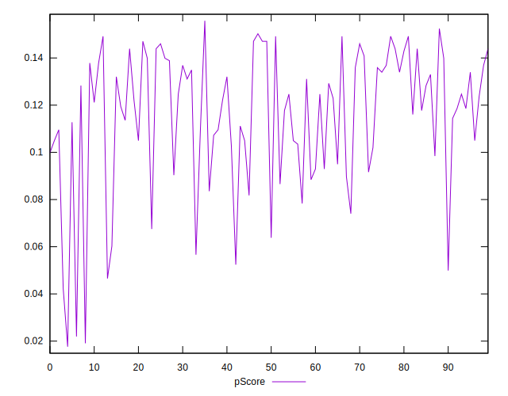

# //max-potential-fid/samples/pages+cached

[→ Parent](../..)


## Raw


```yaml
p90min: 419
p90max: 544
p90range: 125
p90mean: 455.61538461538464
p90median: 450
p90stdev: 27.571592814826243
p90skewness: 1.0281080638634659
p90eccentricity: 1.0000000000000002
p90discretization: 1.625
outlandishness: 1.0672219006429204
confidence: 22.879950330688075
p90confidence: 11.329721817322252

```


## Score


```yaml
p90min: 0.06
p90max: 0.16
p90range: 0.1
p90mean: 0.12120879120879122
p90median: 0.12
p90stdev: 0.022718301903882833
p90skewness: -0.5262182073627569
p90eccentricity: 1.0000000000000009
p90discretization: 8.272727272727273
outlandishness: 0.8845888531155047
confidence: 0.012506966186036667
p90confidence: 0.009335407006102553

```


## Raw Estimate


## Score Estimate


## P Score


```yaml
p90min: 0.06379116448723543
p90max: 0.15575717398606526
p90range: 0.09196600949882983
p90mean: 0.12198491800060224
p90median: 0.12467453517163446
p90stdev: 0.021897632050794803
p90skewness: -0.6210859824198052
p90eccentricity: 0.9999999999999999
p90discretization: 1.625
outlandishness: 0.8836974547322882
confidence: 0.012392871528712851
p90confidence: 0.008998177263816853

```


## Score Difference


```yaml
p90min: 0
p90max: 0
p90range: 0
p90mean: 0
p90median: 0
p90stdev: 0
p90skewness: .nan
p90eccentricity: .nan
p90discretization: 91
outlandishness: .nan
confidence: 0
p90confidence: 0

```


## P Score Difference


```yaml
p90min: -0.0034690826428646765
p90max: 0.004964372903314168
p90range: 0.008433455546178845
p90mean: 0.0008430387144492862
p90median: 0.0008605299795423349
p90stdev: 0.0026109295554550558
p90skewness: -0.013505276248914443
p90eccentricity: 0.9999999999999997
p90discretization: 1.4918032786885247
outlandishness: 0.6356709995406146
confidence: 0.0011177082157626422
p90confidence: 0.0010728834473438134

```

