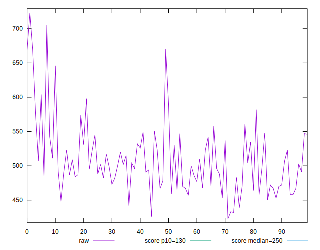

# //max-potential-fid/samples/pages

[→ Parent](../..)


## Raw


```yaml
p90min: 426
p90max: 590.0000000000018
p90range: 164.00000000000182
p90mean: 498.3736263736264
p90median: 495
p90stdev: 36.346213234940166
p90skewness: 0.35691418882201076
p90eccentricity: 0.9999999999999999
p90discretization: 1.2133333333333334
outlandishness: 1.0496258219938208
confidence: 22.677458860328557
p90confidence: 14.935389762593331

```


## Score


```yaml
p90min: 0.04
p90max: 0.14
p90range: 0.1
p90mean: 0.0886813186813187
p90median: 0.09
p90stdev: 0.022880904808474833
p90skewness: -0.05258155013302188
p90eccentricity: 0.9999999999999983
p90discretization: 8.272727272727273
outlandishness: 0.9558151504263338
confidence: 0.011129489422160826
p90confidence: 0.009402223808747528

```


## Raw Estimate


## Score Estimate


## P Score


```yaml
p90min: 0.04192712360233858
p90max: 0.14086052997954235
p90range: 0.09893340637720377
p90mean: 0.08892370867561222
p90median: 0.08968880625091713
p90stdev: 0.022325262401366355
p90skewness: -0.006055421793107089
p90eccentricity: 1.0000000000000002
p90discretization: 1.2133333333333334
outlandishness: 0.9539063577315364
confidence: 0.011055909668521574
p90confidence: 0.009173899172418898

```


## Score Difference


```yaml
p90min: 0
p90max: 0
p90range: 0
p90mean: 0
p90median: 0
p90stdev: 0
p90skewness: .nan
p90eccentricity: .nan
p90discretization: 91
outlandishness: .nan
confidence: 0
p90confidence: 0

```


## P Score Difference


```yaml
p90min: -0.004357423923150333
p90max: 0.00453808758933838
p90range: 0.008895511512488713
p90mean: -0.00010506674514638817
p90median: 0.0003311376708872438
p90stdev: 0.002544793595495391
p90skewness: 0.009052190208285673
p90eccentricity: 1.0000000000000002
p90discretization: 1.2133333333333334
outlandishness: 2.0415739038350202
confidence: 0.0011025540965072132
p90confidence: 0.0010457068517261078

```

