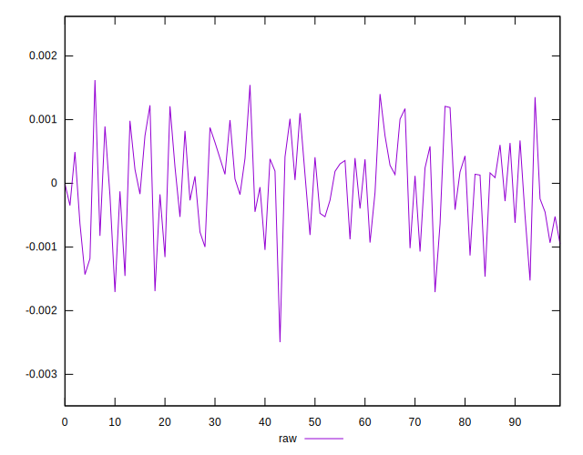
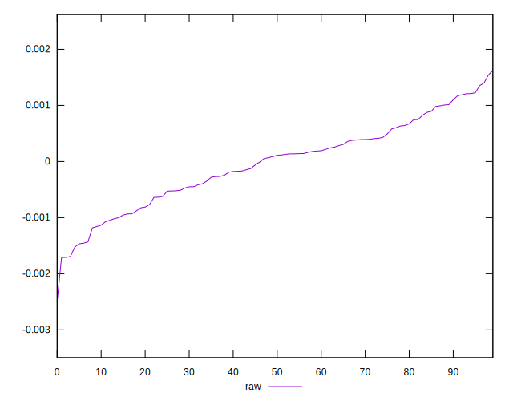
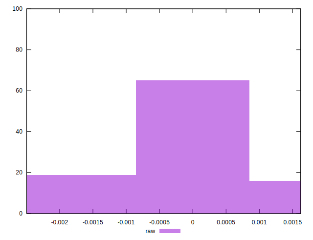

# //meta/pScore-difference/samples/pages+cached+noadtech+nomedia+nocss

[→ Parent](../..)


## Raw


```yaml
p90min: -0.0014552520008061954
p90max: 0.0013526921260294921
p90range: 0.0028079441268356875
p90mean: 0.000017772800817236842
p90median: 0.00011718150770405056
p90stdev: 0.0006908049625388092
p90skewness: -0.0926013101601881
p90eccentricity: 0.9999999999999999
p90discretization: 1
outlandishness: 6.174036861051846
confidence: 0.0003271414646566273
p90confidence: 0.0002838656478120402

```

