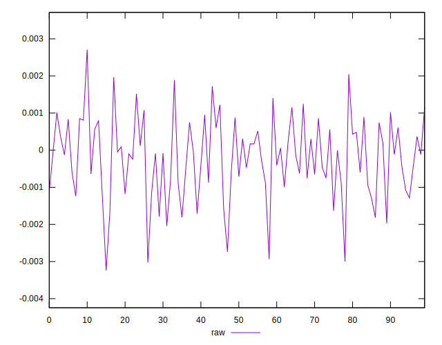

# //meta/pScore-difference/samples/pages+cached+noadtech+nomedia

[→ Parent](../..)


## Raw


```yaml
p90min: -0.0020432732445572746
p90max: 0.0017207535044053764
p90range: 0.0037640267489626508
p90mean: -0.0001685598026849656
p90median: -0.00011794320468412386
p90stdev: 0.0009063063276702355
p90skewness: -0.10267304482469995
p90eccentricity: 0.9999999999999999
p90discretization: 1
outlandishness: 1.6535155045020922
confidence: 0.0004578383451549764
p90confidence: 0.0003724194914216605

```

