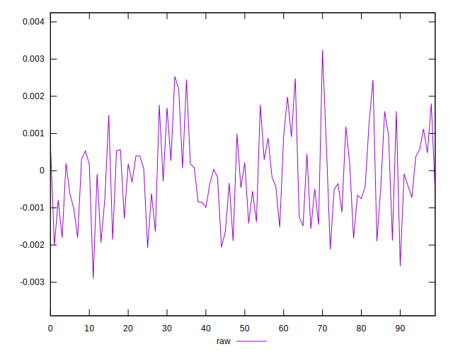
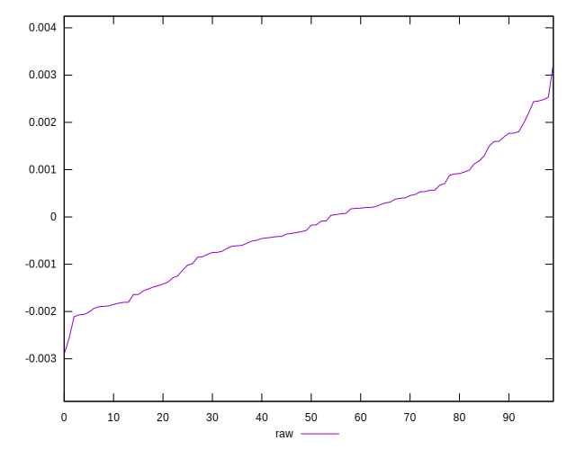
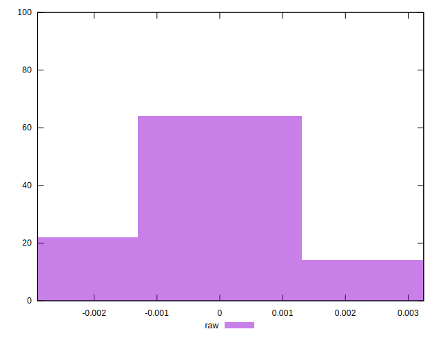

# //meta/pScore-difference/samples/pages+cached+noadtech

[→ Parent](../..)


## Raw


```yaml
p90min: -0.002112058151794783
p90max: 0.0018035360293860376
p90range: 0.00391559418118082
p90mean: -0.0002863636268862111
p90median: -0.00033009041952716036
p90stdev: 0.0010573678454197958
p90skewness: 0.06177506966410717
p90eccentricity: 1.0000000000000004
p90discretization: 1
outlandishness: 0.24556153642642886
confidence: 0.0005050958044201402
p90confidence: 0.0004344937061723107

```

