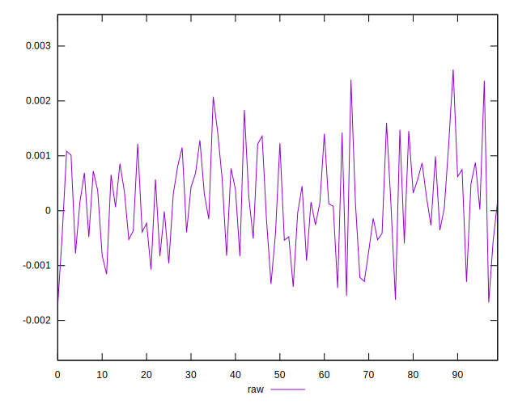
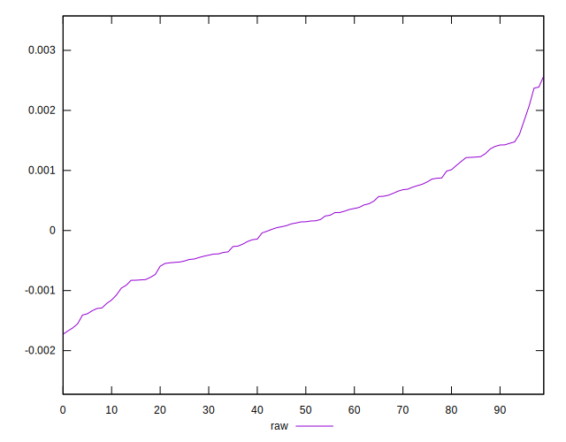
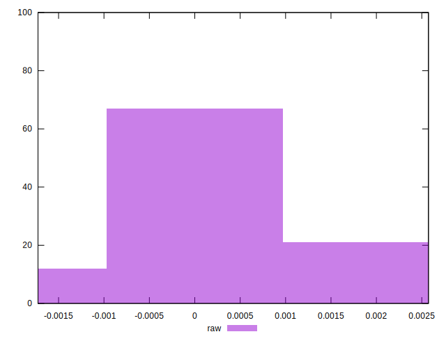

# //meta/pScore-difference/samples/pages+cached

[→ Parent](../..)


## Raw


```yaml
p90min: -0.001407754623840942
p90max: 0.001601046641772762
p90range: 0.003008801265613704
p90mean: 0.00011622508257893621
p90median: 0.00014385037019208388
p90stdev: 0.0007896643120944421
p90skewness: -0.03145977624474584
p90eccentricity: 0.9999999999999999
p90discretization: 1
outlandishness: 1.721572053326123
confidence: 0.0003761773751365739
p90confidence: 0.0003244889421218434

```

