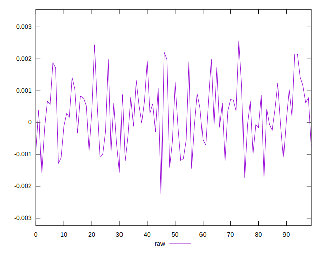
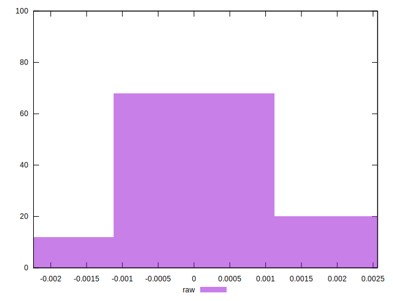

# //meta/pScore-difference/samples/pages

[→ Parent](../..)


## Raw


```yaml
p90min: -0.0015647130648939083
p90max: 0.002004108405735065
p90range: 0.003568821470628973
p90mean: 0.00022655053062595008
p90median: 0.0003537521870988181
p90stdev: 0.0009117054160560077
p90skewness: 0.007253581078939569
p90eccentricity: 1
p90discretization: 1
outlandishness: 1.2051742867504436
confidence: 0.00041925375382116995
p90confidence: 0.0003746380853886018

```

