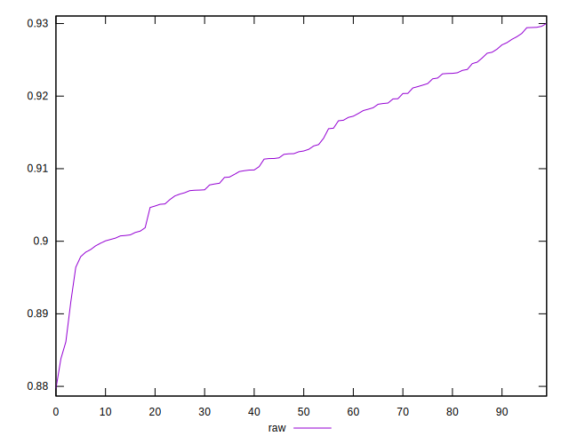
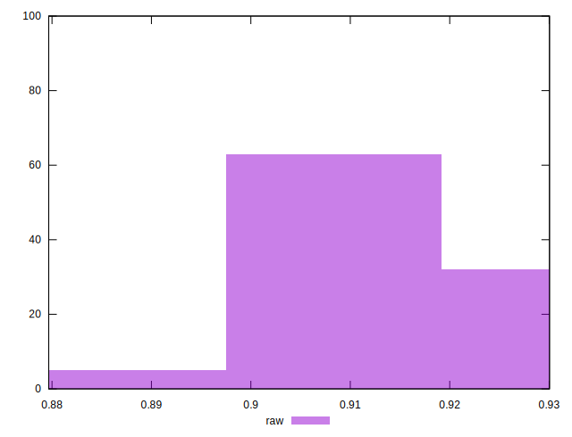

# //meta/pScore/samples/pages+cached+noadtech+nomedia+nocss

[→ Parent](../..)


## Raw


```yaml
p90min: 0.8964146803762277
p90max: 0.9286416192826773
p90range: 0.032226938906449565
p90mean: 0.913195823447775
p90median: 0.9123305027560404
p90stdev: 0.008767628444351961
p90skewness: -0.04190199486532346
p90eccentricity: 1.0000000000000002
p90discretization: 1
outlandishness: 0.9993540553787065
confidence: 0.004206887427847583
p90confidence: 0.003602794801856213

```

