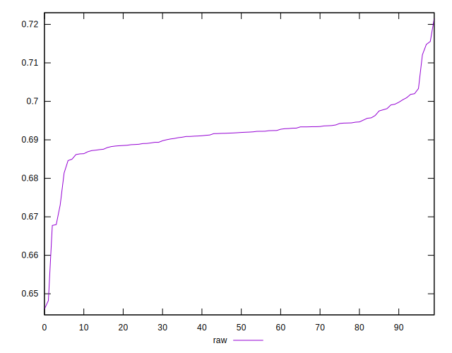
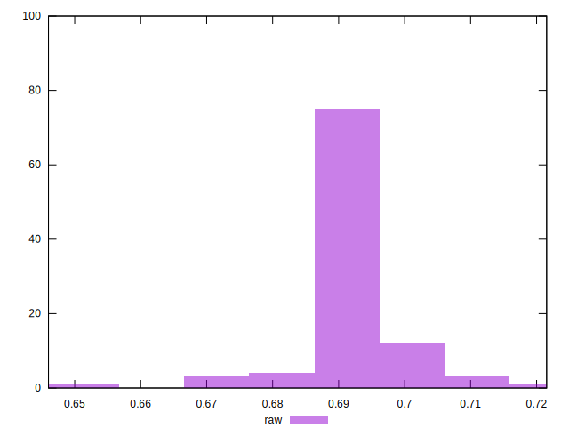

# //meta/pScore/samples/pages+cached+noadtech+nomedia

[→ Parent](../..)


## Raw


```yaml
p90min: 0.6813909466706163
p90max: 0.7033329244710547
p90range: 0.021941977800438384
p90mean: 0.6920967843027035
p90median: 0.6919208314152527
p90stdev: 0.004003186953241972
p90skewness: 0.4872763455866146
p90eccentricity: 0.9999999999999997
p90discretization: 1
outlandishness: 0.9982133786933328
confidence: 0.003787597913379237
p90confidence: 0.001644990003572655

```

