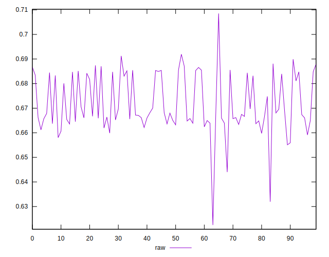
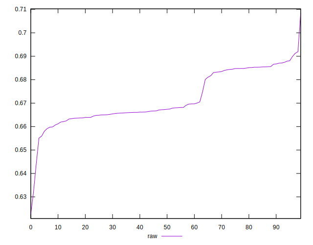
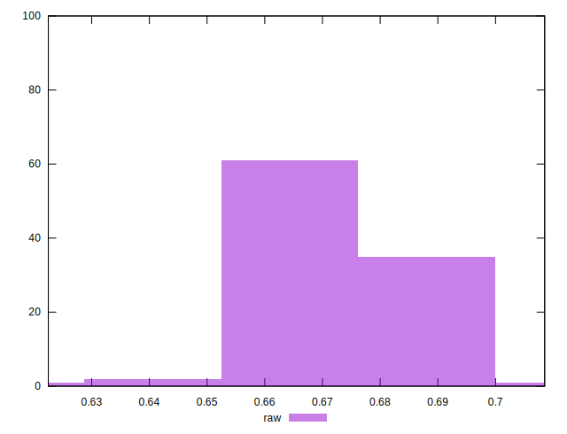

# //meta/pScore/samples/pages+cached+noadtech

[→ Parent](../..)


## Raw


```yaml
p90min: 0.6559346158524235
p90max: 0.6878997047707195
p90range: 0.03196508891829597
p90mean: 0.6719729373795587
p90median: 0.667254126438671
p90stdev: 0.009617879317550147
p90skewness: 0.4742018253851606
p90eccentricity: 0.9999999999999999
p90discretization: 1
outlandishness: 0.9992714055372792
confidence: 0.004992192560023367
p90confidence: 0.003952179980034609

```

