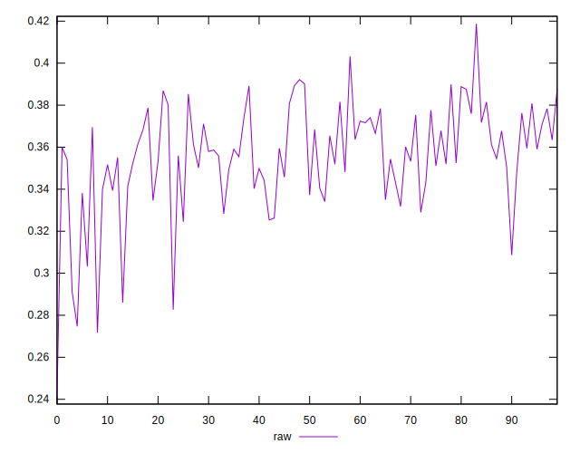
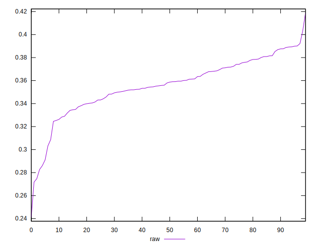
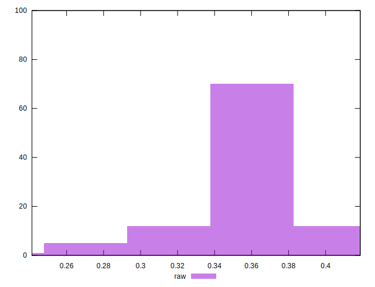

# //meta/pScore/samples/pages+cached

[→ Parent](../..)


## Raw


```yaml
p90min: 0.3086198293370436
p90max: 0.3921642364131322
p90range: 0.08354440707608857
p90mean: 0.35963862264541757
p90median: 0.35907550045150083
p90stdev: 0.018252959272079594
p90skewness: -0.20217169666251691
p90eccentricity: 1
p90discretization: 1
outlandishness: 0.9743566004456787
confidence: 0.011207344497749627
p90confidence: 0.00750050794252155

```

