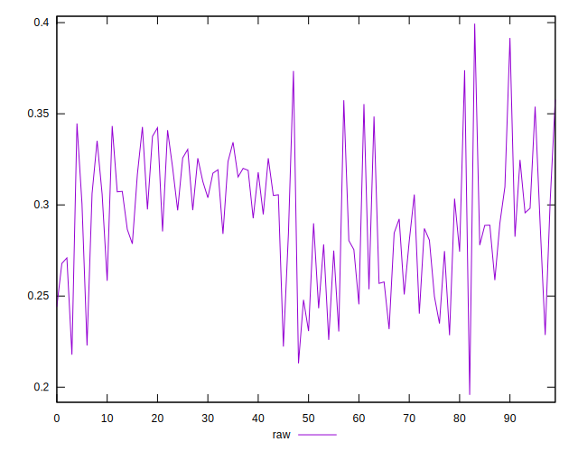
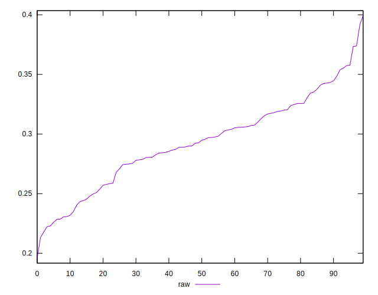
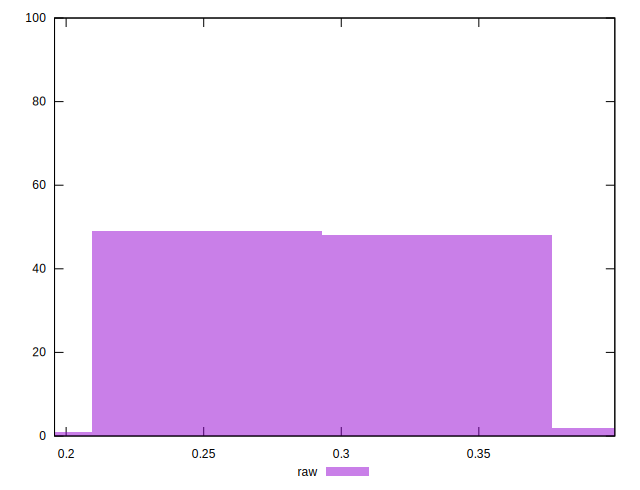

# //meta/pScore/samples/pages

[→ Parent](../..)


## Raw


```yaml
p90min: 0.22594615677628915
p90max: 0.35776432339945763
p90range: 0.13181816662316848
p90mean: 0.2935403687684909
p90median: 0.2947941179211595
p90stdev: 0.03392753253786168
p90skewness: -0.15357589899802437
p90eccentricity: 1.0000000000000002
p90discretization: 1
outlandishness: 0.9978436368285912
confidence: 0.01617398671688941
p90confidence: 0.013941505236339635

```

