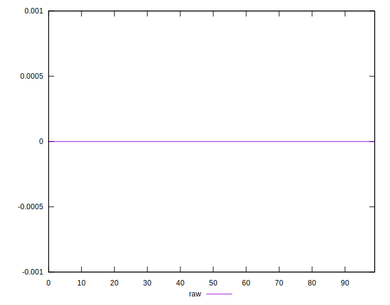

# //meta/score-difference/samples/pages+cached+noadtech+nomedia+nocss

[→ Parent](../..)


## Raw


```yaml
p90min: 0
p90max: 2.7755575615628914e-17
p90range: 2.7755575615628914e-17
p90mean: 4.087084760982718e-18
p90median: 0
p90stdev: 7.30692291639299e-18
p90skewness: 2.5171849351629287
p90eccentricity: 0.9999999999999993
p90discretization: 30.333333333333332
outlandishness: 2.482270795277343
confidence: 4.020828223389036e-18
p90confidence: 3.0025615327828675e-18

```

