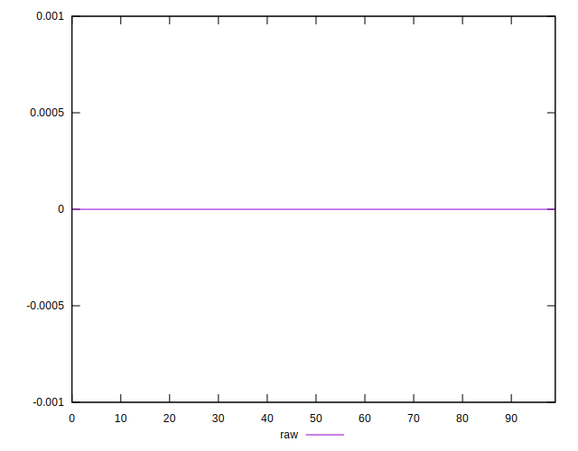

# //meta/score-difference/samples/pages+cached

[→ Parent](../..)


## Raw


```yaml
p90min: 0
p90max: 1.3877787807814457e-17
p90range: 1.3877787807814457e-17
p90mean: 1.982541115402065e-18
p90median: 0
p90stdev: 4.856214126823279e-18
p90skewness: 2.041241452319316
p90eccentricity: 1.0000000000000002
p90discretization: 45.5
outlandishness: 2.6373759999999997
confidence: 2.3872582911849414e-18
p90confidence: 1.9955160193963238e-18

```

