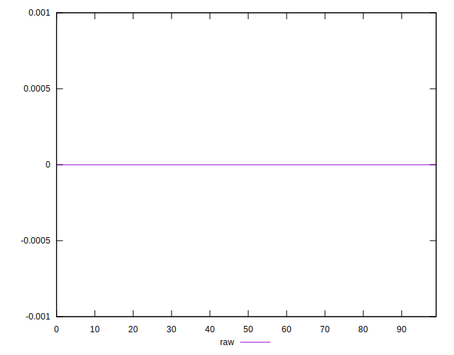

# //meta/score-difference/samples/pages

[→ Parent](../..)


## Raw


```yaml
p90min: 0
p90max: 2.7755575615628914e-17
p90range: 2.7755575615628914e-17
p90mean: 2.3485487059378305e-18
p90median: 0
p90stdev: 6.046360958281912e-18
p90skewness: 2.652833022429971
p90eccentricity: 1.0000000000000018
p90discretization: 22.75
outlandishness: 4.626409917355374
confidence: 4.1383438383307874e-18
p90confidence: 2.4845712804671675e-18

```

