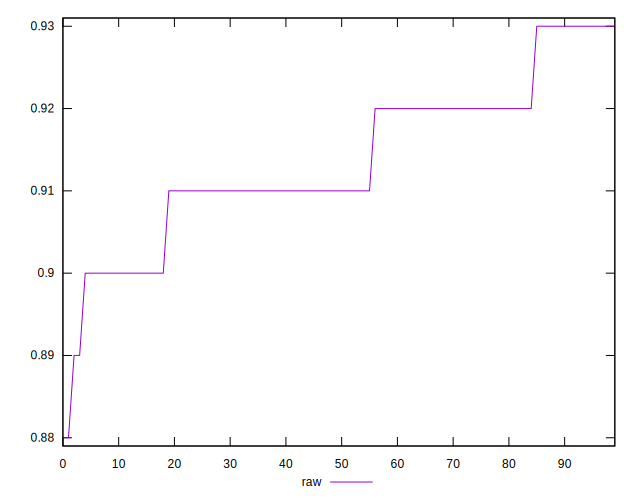

# //meta/score/samples/pages+cached+noadtech+nomedia+nocss

[→ Parent](../..)


## Raw


```yaml
p90min: 0.9
p90max: 0.93
p90range: 0.030000000000000027
p90mean: 0.9137362637362638
p90median: 0.91
p90stdev: 0.00885144200685814
p90skewness: 0.1479804052327751
p90eccentricity: 1.0000000000000018
p90discretization: 22.75
outlandishness: 0.9992641161887486
confidence: 0.004266063209672488
p90confidence: 0.00363723547977024

```

