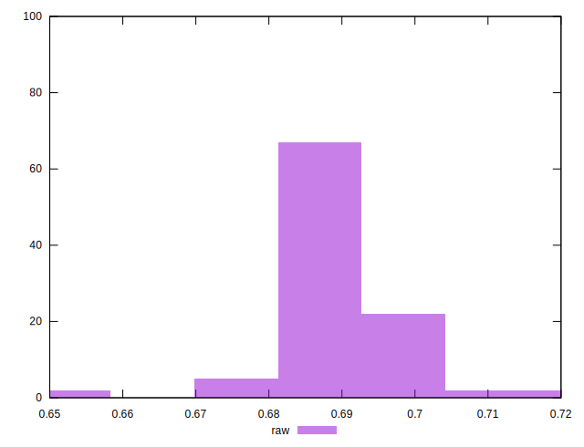

# //meta/score/samples/pages+cached+noadtech+nomedia

[→ Parent](../..)


## Raw


```yaml
p90min: 0.68
p90max: 0.7
p90range: 0.019999999999999907
p90mean: 0.6921978021978015
p90median: 0.69
p90stdev: 0.004641475182844584
p90skewness: 0.6712534795495982
p90eccentricity: 0.9999999999999997
p90discretization: 30.333333333333332
outlandishness: 0.9982734875603374
confidence: 0.0037484022973222064
p90confidence: 0.0019072754699669403

```

