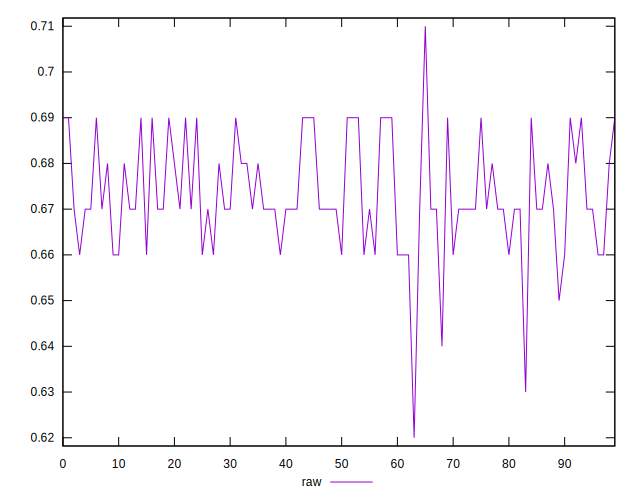
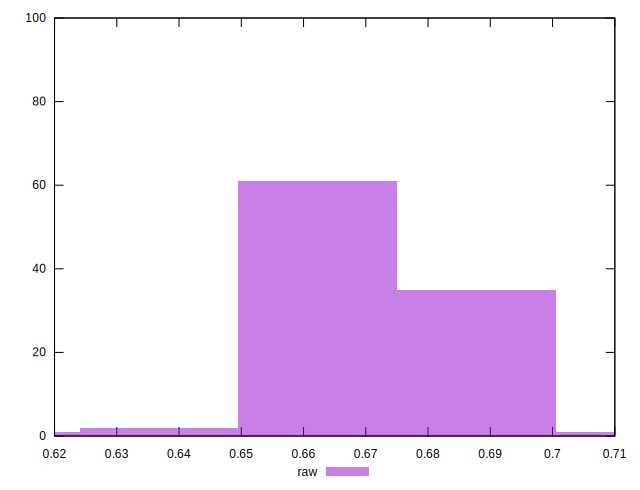

# //meta/score/samples/pages+cached+noadtech

[→ Parent](../..)


## Raw


```yaml
p90min: 0.66
p90max: 0.69
p90range: 0.029999999999999916
p90mean: 0.6736263736263736
p90median: 0.67
p90stdev: 0.010326162602930528
p90skewness: 0.43011883054721217
p90eccentricity: 1
p90discretization: 22.75
outlandishness: 0.998437804717792
confidence: 0.00533729538537453
p90confidence: 0.004243227822105622

```

