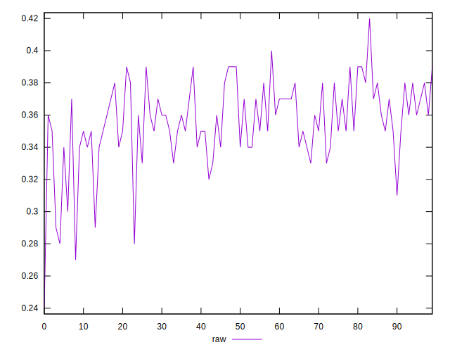
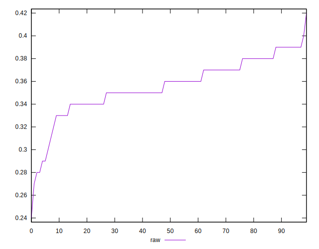
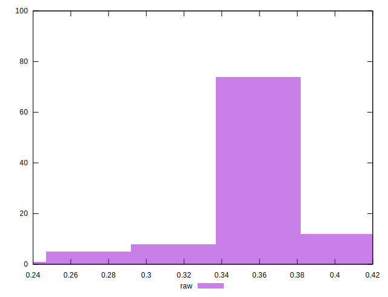

# //meta/score/samples/pages+cached

[→ Parent](../..)


## Raw


```yaml
p90min: 0.32
p90max: 0.4
p90range: 0.08000000000000002
p90mean: 0.36065934065934074
p90median: 0.36
p90stdev: 0.018205312459913234
p90skewness: 0.10984898200009402
p90eccentricity: 1.0000000000000007
p90discretization: 10.11111111111111
outlandishness: 0.9688629250605583
confidence: 0.01125913589414862
p90confidence: 0.007480928909458395

```

