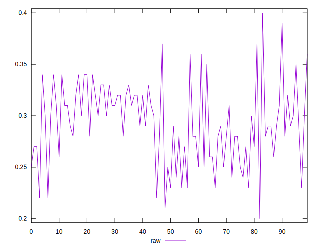
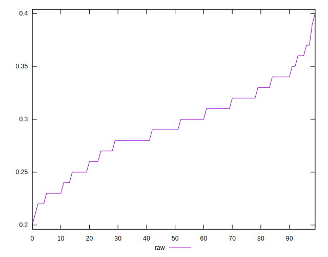
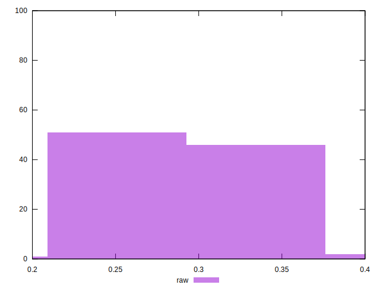

# //meta/score/samples/pages

[→ Parent](../..)


## Raw


```yaml
p90min: 0.23
p90max: 0.36
p90range: 0.12999999999999998
p90mean: 0.29351648351648363
p90median: 0.29
p90stdev: 0.03388323928017895
p90skewness: -0.09664224635360837
p90eccentricity: 0.9999999999999981
p90discretization: 6.5
outlandishness: 0.9971641249713877
confidence: 0.01610222245461923
p90confidence: 0.013923304246237223

```

