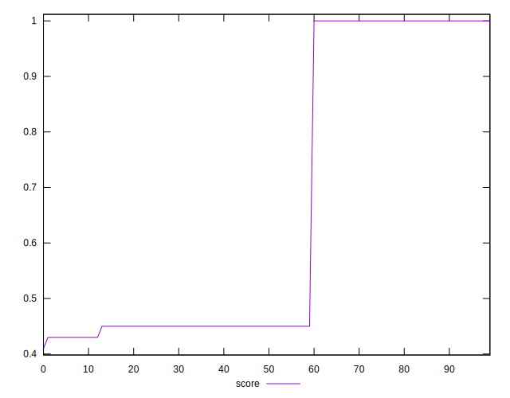
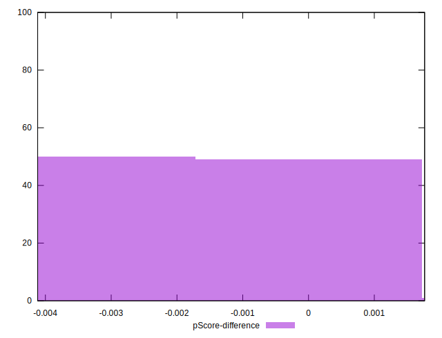

# //offscreen-images/samples/pages

[→ Parent](../..)


## Raw


```yaml
p90min: 0
p90max: 1360
p90range: 1360
p90mean: 798.9010989010989
p90median: 1200
p90stdev: 590.3983578803409
p90skewness: -0.5987364052953621
p90eccentricity: 1.0000000000000024
p90discretization: 18.2
outlandishness: 0.8626244698020357
confidence: 238.41928699602317
p90confidence: 242.6065552727589

```


## Score


```yaml
p90min: 0.41
p90max: 1
p90range: 0.5900000000000001
p90mean: 0.6342857142857156
p90median: 0.45
p90stdev: 0.2629801432237503
p90skewness: 0.6698108850910955
p90eccentricity: 0.9999999999999989
p90discretization: 22.75
outlandishness: 1.1064765522279034
confidence: 0.10655295847171198
p90confidence: 0.10806382809347448

```


## Raw Estimate


## Score Estimate


## P Score


```yaml
p90min: 0.4117647058823529
p90max: 1
p90range: 0.5882352941176471
p90mean: 0.6325791855203614
p90median: 0.4470588235294118
p90stdev: 0.26418365161623897
p90skewness: 0.670392426203276
p90eccentricity: 0.9999999999999992
p90discretization: 15.166666666666666
outlandishness: 1.1072819981948474
confidence: 0.10704200951095033
p90confidence: 0.10855837388860823

```


## Score Difference


```yaml
p90min: 0
p90max: 0
p90range: 0
p90mean: 0
p90median: 0
p90stdev: 0
p90skewness: .nan
p90eccentricity: .nan
p90discretization: 91
outlandishness: .inf
confidence: 2.1650898205369656e-18
p90confidence: 0

```


## P Score Difference


```yaml
p90min: -0.002941176470588225
p90max: 0
p90range: 0.002941176470588225
p90mean: -0.0014091790562378718
p90median: -0.0005882352941176117
p90stdev: 0.0013976865418735157
p90skewness: -0.12011792485476146
p90eccentricity: 0.999999999999998
p90discretization: 22.75
outlandishness: 1.21444444070365
confidence: 0.0006061509060399694
p90confidence: 0.0005743375006875494

```

