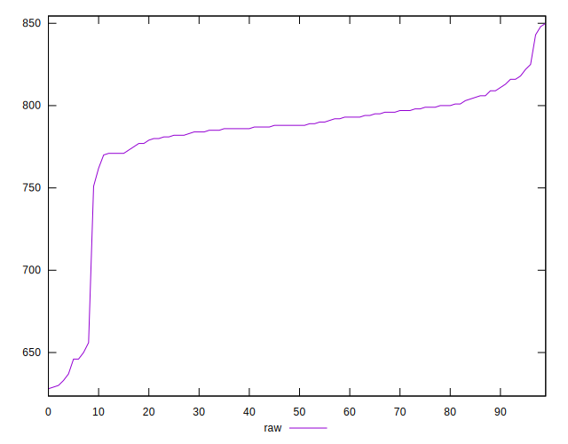
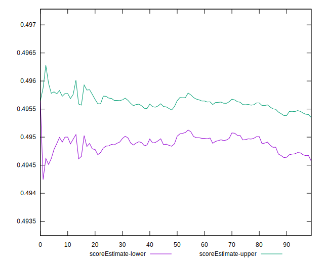
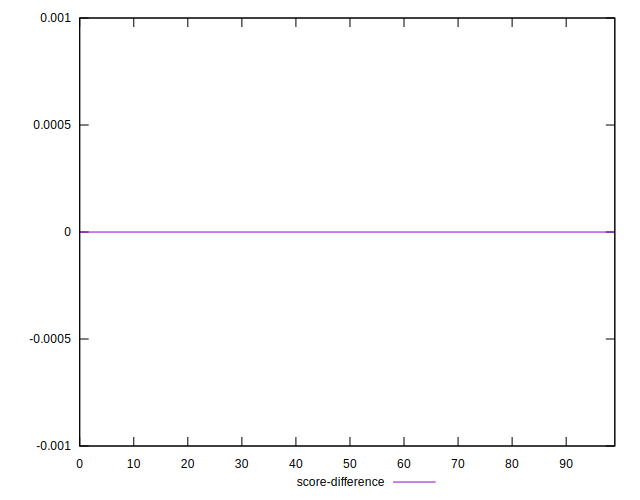

# //render-blocking-resources/samples/pages+cached+noadtech+nomedia

[→ Parent](../..)


## Raw


```yaml
p90min: 751
p90max: 850
p90range: 99
p90mean: 792.8241758241758
p90median: 790
p90stdev: 16.101050000975743
p90skewness: 1.0948900746677013
p90eccentricity: 0.9999999999999999
p90discretization: 2.0681818181818183
outlandishness: 0.9654803643623427
confidence: 18.265011949847576
p90confidence: 6.6162451586676525

```


## Score


```yaml
p90min: 0.49
p90max: 0.5
p90range: 0.010000000000000009
p90mean: 0.4954945054945057
p90median: 0.5
p90stdev: 0.004975486339635947
p90skewness: -0.19877674693474268
p90eccentricity: 0.9999999999999989
p90discretization: 45.5
outlandishness: 1.0243873074186267
confidence: 0.007748677394720294
p90confidence: 0.0020445273696211297

```


## Raw Estimate


## Score Estimate


## P Score


```yaml
p90min: 0.48823529411764705
p90max: 0.49988235294117644
p90range: 0.0116470588235294
p90mean: 0.4949618616677442
p90median: 0.49529411764705883
p90stdev: 0.0018942411765853842
p90skewness: -1.0948900746676222
p90eccentricity: 0.9999999999999993
p90discretization: 2.0681818181818183
outlandishness: 1.0243143955778051
confidence: 0.007515708573508806
p90confidence: 0.0007783817833726392

```


## Score Difference


```yaml
p90min: 0
p90max: 0
p90range: 0
p90mean: 0
p90median: 0
p90stdev: 0
p90skewness: .nan
p90eccentricity: .nan
p90discretization: 91
outlandishness: .inf
confidence: 7.42394611483107e-18
p90confidence: 0

```


## P Score Difference


```yaml
p90min: -0.004941176470588227
p90max: 0.004588235294117671
p90range: 0.009529411764705897
p90mean: -0.00109358615240968
p90median: -0.002705882352941169
p90stdev: 0.0035473177051605826
p90skewness: 0.533876882974424
p90eccentricity: 0.9999999999999993
p90discretization: 1.9361702127659575
outlandishness: 0.2593535902499114
confidence: 0.0014856435742375733
p90confidence: 0.001457664164237902

```

