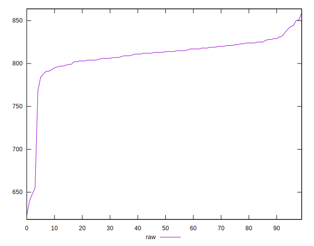
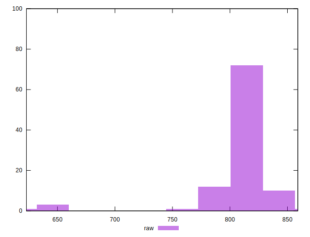
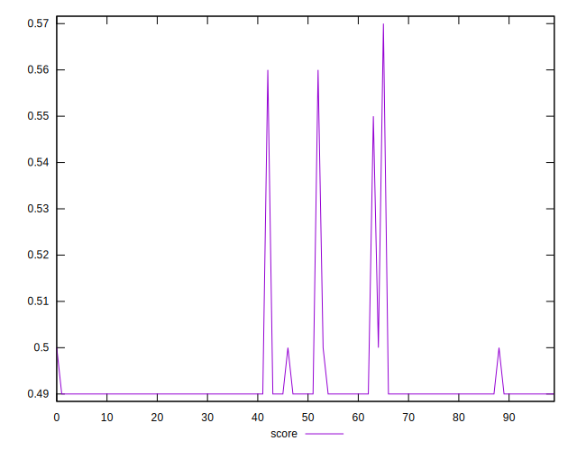
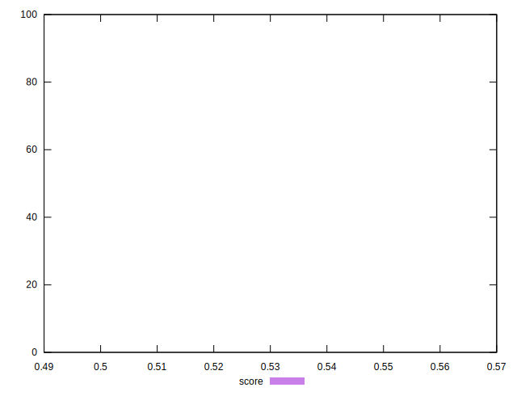
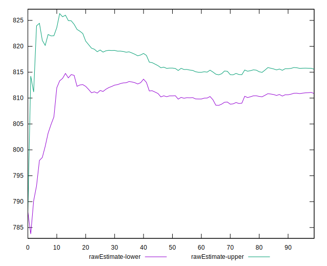
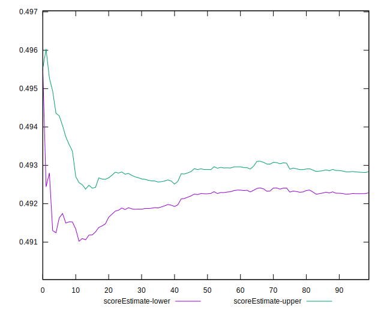
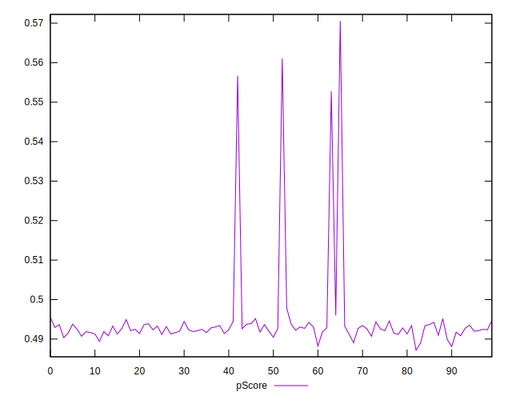
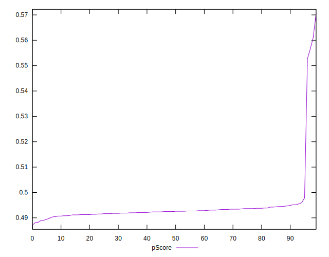
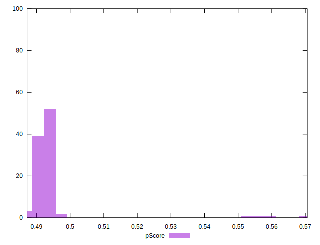
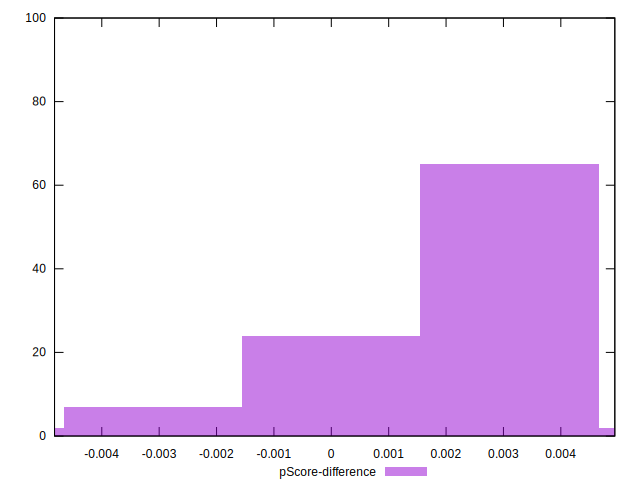

# //render-blocking-resources/samples/pages+cached+noadtech

[→ Parent](../..)


## Raw


```yaml
p90min: 784
p90max: 843
p90range: 59
p90mean: 813.2197802197802
p90median: 814
p90stdev: 11.386132106527706
p90skewness: -0.06902158621689418
p90eccentricity: 0.9999999999999999
p90discretization: 2.2195121951219514
outlandishness: 0.985762699500668
confidence: 14.392606344855722
p90confidence: 4.678790601929677

```


## Score


```yaml
p90min: 0.49
p90max: 0.49
p90range: 0
p90mean: 0.49000000000000005
p90median: 0.49
p90stdev: 5.551115123125783e-17
p90skewness: -1
p90eccentricity: 1
p90discretization: 91
outlandishness: 1.0135147438567271
confidence: 0.005433167231159164
p90confidence: 0

```


## Raw Estimate


## Score Estimate


## P Score


```yaml
p90min: 0.4894117647058824
p90max: 0.49788235294117644
p90range: 0.008470588235294063
p90mean: 0.49265934065934053
p90median: 0.49258823529411766
p90stdev: 0.0014003936718299894
p90skewness: 0.6269144245882997
p90eccentricity: 0.9999999999999996
p90discretization: 2.2195121951219514
outlandishness: 1.0101219728037567
confidence: 0.005276868112213617
p90confidence: 0.0005754499148138414

```


## Score Difference


```yaml
p90min: 0
p90max: 0
p90range: 0
p90mean: 0
p90median: 0
p90stdev: 0
p90skewness: .nan
p90eccentricity: .nan
p90discretization: 91
outlandishness: .inf
confidence: 4.330179641073933e-18
p90confidence: 0

```


## P Score Difference


```yaml
p90min: -0.0010588235294117787
p90max: 0.004941176470588227
p90range: 0.006000000000000005
p90mean: 0.0023591180061768393
p90median: 0.0024705882352941133
p90stdev: 0.0012602743738520457
p90skewness: -0.31340350339573947
p90eccentricity: 1.0000000000000009
p90discretization: 2.1666666666666665
outlandishness: 0.6125685725853908
confidence: 0.0008060314322139157
p90confidence: 0.0005178720781617522

```

