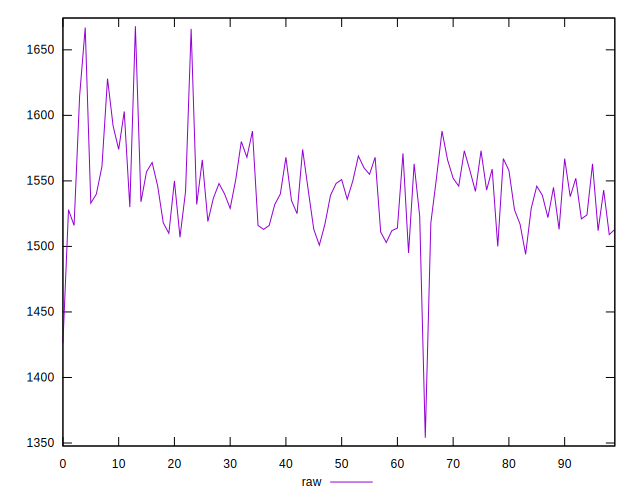
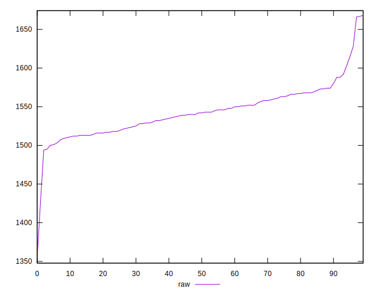

# //render-blocking-resources/samples/pages+cached

[→ Parent](../..)


## Raw


```yaml
p90min: 1495
p90max: 1592
p90range: 97
p90mean: 1540.6263736263736
p90median: 1540
p90stdev: 22.850035877360614
p90skewness: 0.11301796858886139
p90eccentricity: 0.9999999999999999
p90discretization: 1.5689655172413792
outlandishness: 1.0033177969257954
confidence: 15.776079203834797
p90confidence: 9.389539144329774

```


## Score


```yaml
p90min: 0.4
p90max: 0.41
p90range: 0.009999999999999953
p90mean: 0.40736263736263684
p90median: 0.41
p90stdev: 0.004406579704563368
p90skewness: -1.0723225363153936
p90eccentricity: 0.9999999999999997
p90discretization: 45.5
outlandishness: 0.9977299113168823
confidence: 0.0023319453481105423
p90confidence: 0.0018107521953434347

```


## Raw Estimate


## Score Estimate


## P Score


```yaml
p90min: 0.40094117647058825
p90max: 0.4123529411764706
p90range: 0.011411764705882343
p90mean: 0.4069851325145443
p90median: 0.40705882352941175
p90stdev: 0.002688239514983601
p90skewness: -0.11301796858903496
p90eccentricity: 1
p90discretization: 1.5689655172413792
outlandishness: 0.9985241930265107
confidence: 0.0018560093180982618
p90confidence: 0.001104651664038836

```


## Score Difference


```yaml
p90min: 0
p90max: 5.551115123125783e-17
p90range: 5.551115123125783e-17
p90mean: 4.0870847609827194e-17
p90median: 5.551115123125783e-17
p90stdev: 2.446143123926097e-17
p90skewness: -1.0723225363157056
p90eccentricity: 1.0000000000000013
p90discretization: 45.5
outlandishness: 0.8281000000000001
confidence: 1.0231815306134054e-17
p90confidence: 1.0051693895804053e-17

```


## P Score Difference


```yaml
p90min: -0.0043529411764705594
p90max: 0.004235294117647004
p90range: 0.008588235294117563
p90mean: -0.0004899806076276579
p90median: -0.0003529411764706114
p90stdev: 0.0025486938855180693
p90skewness: 0.2336719140486161
p90eccentricity: 1.0000000000000002
p90discretization: 1.5689655172413792
outlandishness: 0.19306633133993298
confidence: 0.0011143111934446234
p90confidence: 0.0010473095593121588

```

