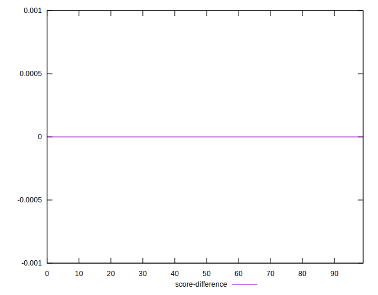

# //render-blocking-resources/samples/pages

[→ Parent](../..)


## Raw


```yaml
p90min: 1127
p90max: 2583
p90range: 1456
p90mean: 1916.8241758241759
p90median: 1811
p90stdev: 359.567034921644
p90skewness: -0.42658800971261385
p90eccentricity: 0.9999999999999996
p90discretization: 1.0459770114942528
outlandishness: 1.3455079628880715
confidence: 414.79365420469185
p90confidence: 147.7533237815337

```


## Score


```yaml
p90min: 0.28
p90max: 0.46
p90range: 0.18
p90mean: 0.3625274725274723
p90median: 0.38
p90stdev: 0.042622632552433856
p90skewness: 0.42036361486497265
p90eccentricity: 0.9999999999999997
p90discretization: 5.055555555555555
outlandishness: 0.8286021070068079
confidence: 0.043565903802498473
p90confidence: 0.0175144966482077

```


## Raw Estimate


## Score Estimate


## P Score


```yaml
p90min: 0.2843529411764706
p90max: 0.4556470588235294
p90range: 0.17129411764705882
p90mean: 0.36272656755009697
p90median: 0.3751764705882353
p90stdev: 0.04230200410842869
p90skewness: 0.42658800971261707
p90eccentricity: 1.0000000000000009
p90discretization: 1.0459770114942528
outlandishness: 0.8289620628587595
confidence: 0.04346004005823201
p90confidence: 0.017382743974298065

```


## Score Difference


```yaml
p90min: 0
p90max: 0
p90range: 0
p90mean: 0
p90median: 0
p90stdev: 0
p90skewness: .nan
p90eccentricity: .nan
p90discretization: 91
outlandishness: .inf
confidence: 3.0463960003014037e-18
p90confidence: 0

```


## P Score Difference


```yaml
p90min: -0.004352941176470615
p90max: 0.004823529411764671
p90range: 0.009176470588235286
p90mean: 0.0005223012281835696
p90median: 0.00047058823529411153
p90stdev: 0.0026740324342241053
p90skewness: -0.0812329411134462
p90eccentricity: 1.0000000000000009
p90discretization: 1.467741935483871
outlandishness: 0.23452922813938765
confidence: 0.0011532035743472033
p90confidence: 0.001098813688919886

```

