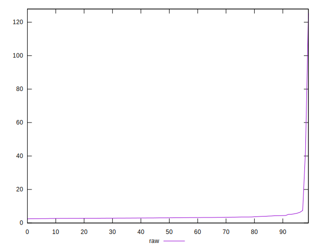
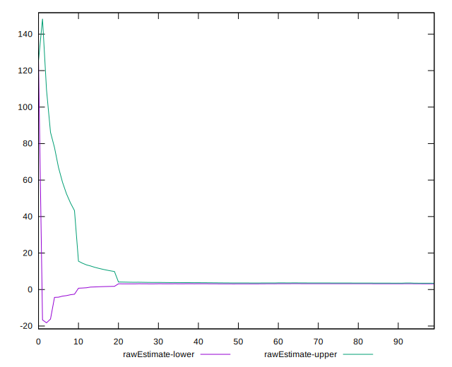

# //server-response-time/samples/pages+cached

[→ Parent](../..)


## Raw


```yaml
p90min: 2.574
p90max: 6.321000000000001
p90range: 3.7470000000000008
p90mean: 3.297681318681318
p90median: 3.076
p90stdev: 0.7134578216526762
p90skewness: 2.0489878637520005
p90eccentricity: 1.0000000000000002
p90discretization: 1.011111111111111
outlandishness: 2.223946611412329
confidence: 5.013899919963689
p90confidence: 0.2931741630599909

```


## Score


```yaml
p90min: 1
p90max: 1
p90range: 0
p90mean: 1
p90median: 1
p90stdev: 0
p90skewness: .nan
p90eccentricity: .nan
p90discretization: 91
outlandishness: 1
confidence: 0
p90confidence: 0

```


## Raw Estimate


## Score Estimate


## P Score


```yaml
p90min: 1
p90max: 1
p90range: 0
p90mean: 1
p90median: 1
p90stdev: 0
p90skewness: .nan
p90eccentricity: .nan
p90discretization: 91
outlandishness: 1
confidence: 0
p90confidence: 0

```


## Score Difference


```yaml
p90min: 0
p90max: 0
p90range: 0
p90mean: 0
p90median: 0
p90stdev: 0
p90skewness: .nan
p90eccentricity: .nan
p90discretization: 91
outlandishness: .nan
confidence: 0
p90confidence: 0

```


## P Score Difference


```yaml
p90min: 0
p90max: 0
p90range: 0
p90mean: 0
p90median: 0
p90stdev: 0
p90skewness: .nan
p90eccentricity: .nan
p90discretization: 91
outlandishness: .nan
confidence: 0
p90confidence: 0

```

