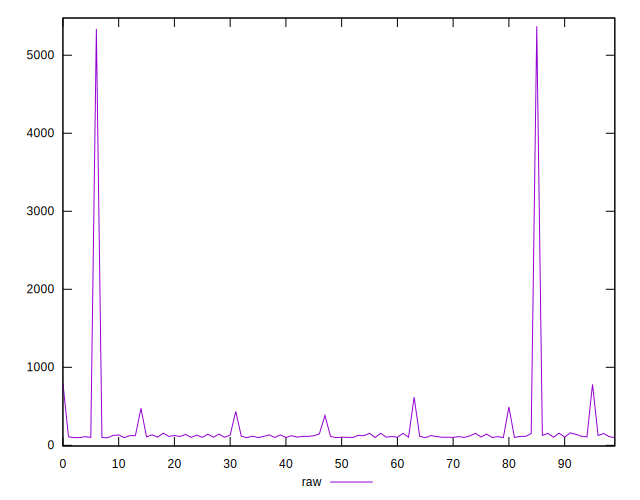
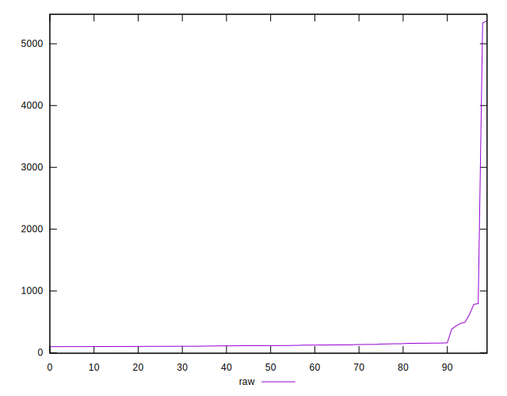

# //server-response-time/samples/pages

[→ Parent](../..)


## Raw


```yaml
p90min: 97.878
p90max: 382.716
p90range: 284.838
p90mean: 121.20259340659342
p90median: 114.059
p90stdev: 32.90135375717026
p90skewness: 5.571711308839291
p90eccentricity: 1
p90discretization: 1
outlandishness: 4.4016545114595464
confidence: 289.62129359684803
p90confidence: 13.519827743923514

```


## Score


```yaml
p90min: 1
p90max: 1
p90range: 0
p90mean: 1
p90median: 1
p90stdev: 0
p90skewness: .nan
p90eccentricity: .nan
p90discretization: 91
outlandishness: 0.9025
confidence: 0.08543284941589402
p90confidence: 0

```


## Raw Estimate


## Score Estimate


## P Score


```yaml
p90min: 1
p90max: 1
p90range: 0
p90mean: 1
p90median: 1
p90stdev: 0
p90skewness: .nan
p90eccentricity: .nan
p90discretization: 91
outlandishness: 0.9025
confidence: 0.08543284941589402
p90confidence: 0

```


## Score Difference


```yaml
p90min: 0
p90max: 0
p90range: 0
p90mean: 0
p90median: 0
p90stdev: 0
p90skewness: .nan
p90eccentricity: .nan
p90discretization: 91
outlandishness: .nan
confidence: 0
p90confidence: 0

```


## P Score Difference


```yaml
p90min: 0
p90max: 0
p90range: 0
p90mean: 0
p90median: 0
p90stdev: 0
p90skewness: .nan
p90eccentricity: .nan
p90discretization: 91
outlandishness: .nan
confidence: 0
p90confidence: 0

```

