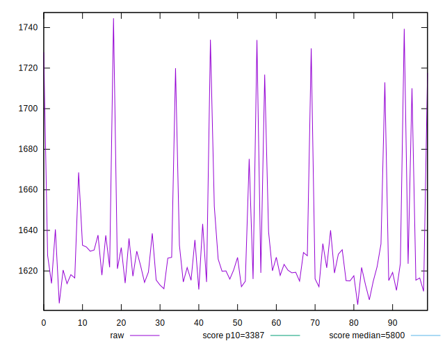
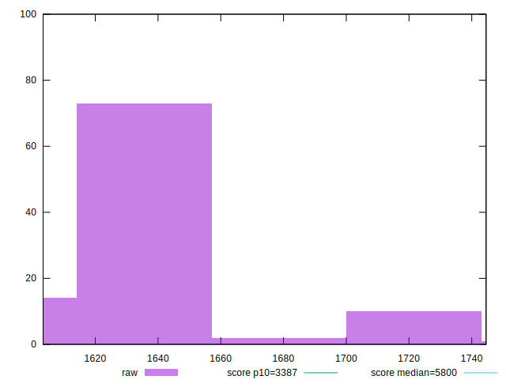
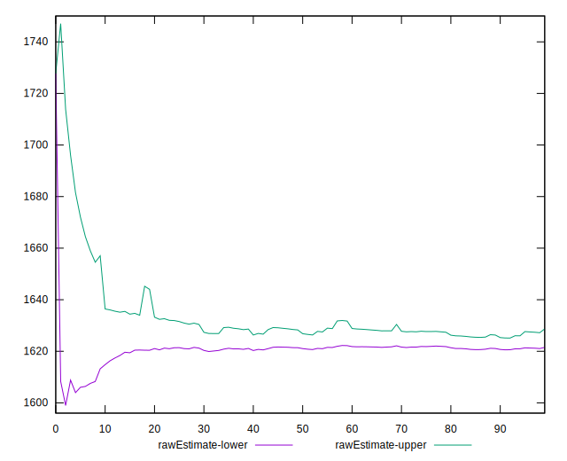
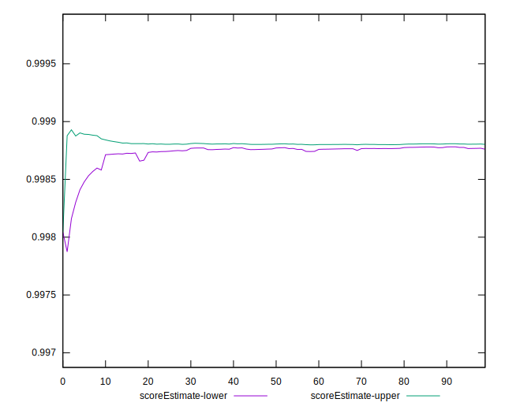
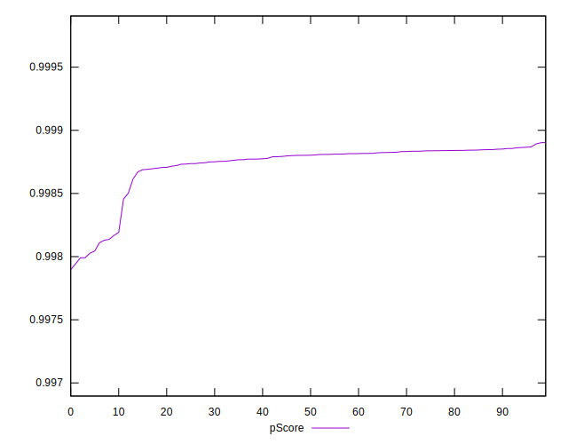
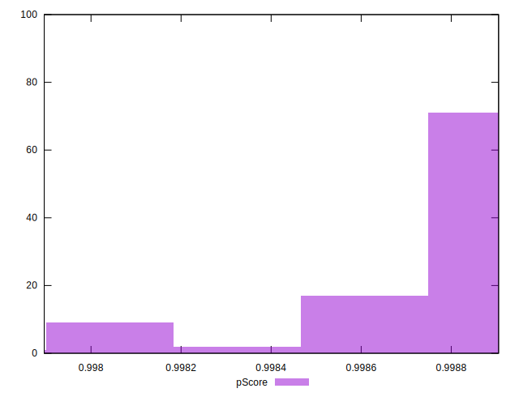
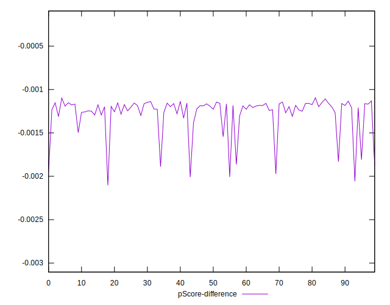
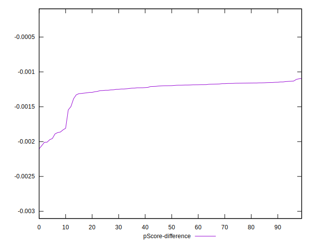
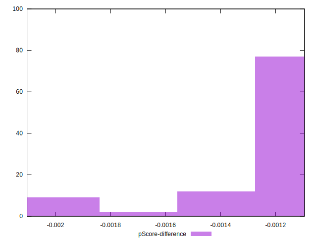

# //speed-index/samples/pages+cached+noadtech+nomedia+nocss

[→ Parent](../..)


## Raw


```yaml
p90min: 1603.369
p90max: 1712.9769999999999
p90range: 109.60799999999995
p90mean: 1625.1106500000005
p90median: 1620.3745000000001
p90stdev: 17.448259474563724
p90skewness: 3.0523695496971
p90eccentricity: 0.9999999999999999
p90discretization: 1
outlandishness: 1.0115730704377055
confidence: 13.429063194273567
p90confidence: 7.16984061714993

```


## Score


```yaml
p90min: 1
p90max: 1
p90range: 0
p90mean: 1
p90median: 1
p90stdev: 0
p90skewness: .nan
p90eccentricity: .nan
p90discretization: 91
outlandishness: 1
confidence: 0
p90confidence: 0

```


## Raw Estimate


## Score Estimate


## P Score


```yaml
p90min: 0.9981677447141033
p90max: 0.9989051482127635
p90range: 0.0007374034986602496
p90mean: 0.9987781895463705
p90median: 0.9988095621987327
p90stdev: 0.00011477820823678418
p90skewness: -3.4759881908967456
p90eccentricity: 1.0000000000000002
p90discretization: 1
outlandishness: 0.9998651338626309
confidence: 0.0000947470218752855
p90confidence: 0.00004716467339216379

```


## Score Difference


```yaml
p90min: 0
p90max: 0
p90range: 0
p90mean: 0
p90median: 0
p90stdev: 0
p90skewness: .nan
p90eccentricity: .nan
p90discretization: 91
outlandishness: .nan
confidence: 0
p90confidence: 0

```


## P Score Difference


```yaml
p90min: -0.0018322552858967
p90max: -0.0010948517872364505
p90range: 0.0007374034986602496
p90mean: -0.001221810453629545
p90median: -0.0011904378012672634
p90stdev: 0.0001147782082367842
p90skewness: -3.475988190900253
p90eccentricity: 1.0000000000000002
p90discretization: 1
outlandishness: 1.1132898847917556
confidence: 0.00009474702187524517
p90confidence: 0.00004716467339217984

```

