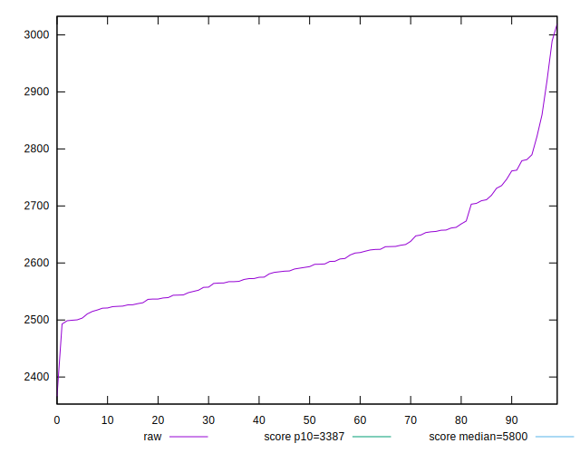
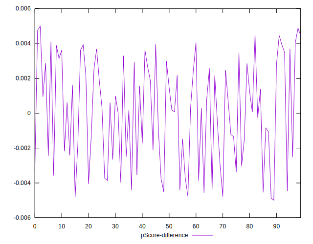

# //speed-index/samples/pages+cached+noadtech+nomedia

[→ Parent](../..)


## Raw


```yaml
p90min: 2492.9018397282994
p90max: 2762.7276621114697
p90range: 269.82582238317036
p90mean: 2596.294553187554
p90median: 2585.970172635434
p90stdev: 65.56241026025991
p90skewness: 0.6384836361172829
p90eccentricity: 0.9999999999999991
p90discretization: 1
outlandishness: 1.0151605847716643
confidence: 40.553928601070766
p90confidence: 26.940912514944102

```


## Score


```yaml
p90min: 0.96
p90max: 0.98
p90range: 0.020000000000000018
p90mean: 0.9723076923076912
p90median: 0.97
p90stdev: 0.0053610157879782315
p90skewness: 0.12660530364372138
p90eccentricity: 1.0000000000000009
p90discretization: 30.333333333333332
outlandishness: 0.9964904264641089
confidence: 0.003077580359357679
p90confidence: 0.002202949171054236

```


## Raw Estimate


## Score Estimate


## P Score


```yaml
p90min: 0.9613791298920966
p90max: 0.977877745070288
p90range: 0.0164986151781914
p90mean: 0.9720772507144366
p90median: 0.9728503999542043
p90stdev: 0.003955672380134112
p90skewness: -0.8216709842877585
p90eccentricity: 1.0000000000000004
p90discretization: 1
outlandishness: 0.9970664026766038
confidence: 0.00270919274996384
p90confidence: 0.0016254653101972494

```


## Score Difference


```yaml
p90min: 0
p90max: 0
p90range: 0
p90mean: 0
p90median: 0
p90stdev: 0
p90skewness: .nan
p90eccentricity: .nan
p90discretization: 91
outlandishness: .inf
confidence: 8.528132291650266e-18
p90confidence: 0

```


## P Score Difference


```yaml
p90min: -0.004540833882650475
p90max: 0.004474685956919688
p90range: 0.009015519839570163
p90mean: 0.0002107836605013515
p90median: 0.00032338025564970785
p90stdev: 0.0028438328974585945
p90skewness: -0.1773807185286379
p90eccentricity: 1
p90discretization: 1
outlandishness: 0.05708599439544341
confidence: 0.001207436884292536
p90confidence: 0.00116858811311872

```

