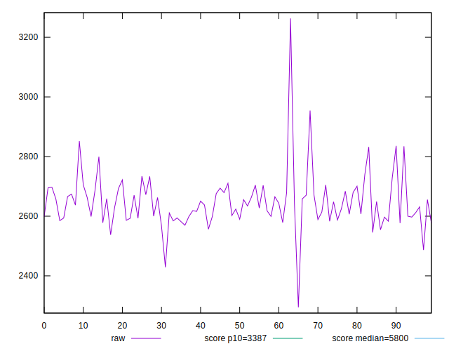
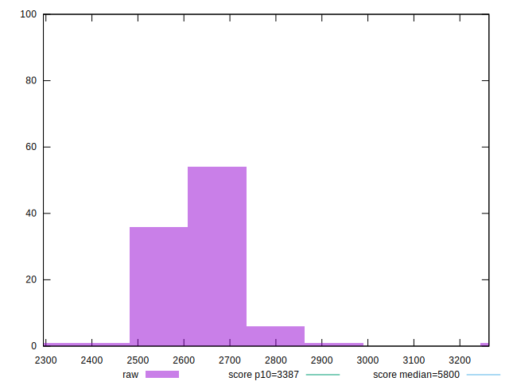
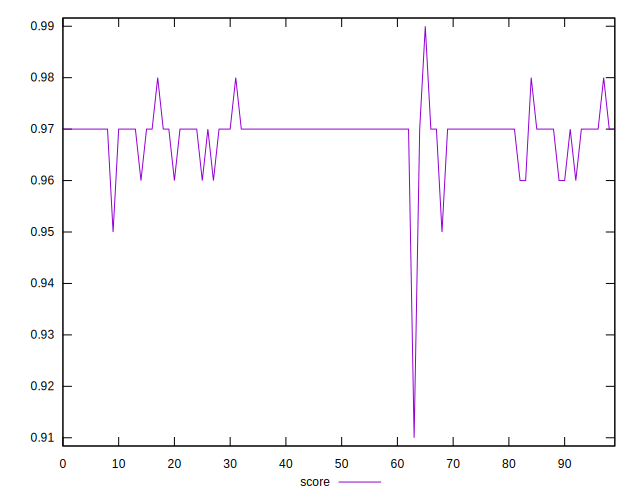
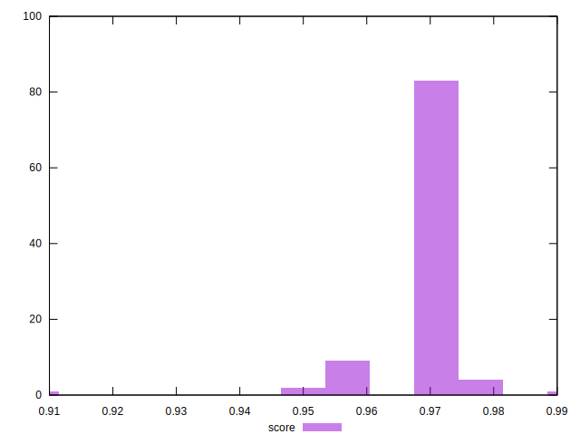
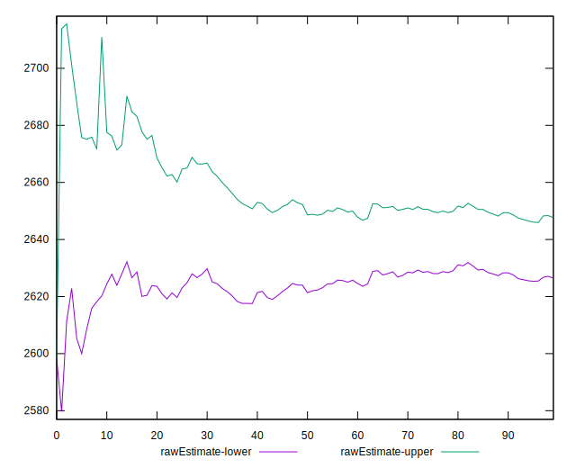
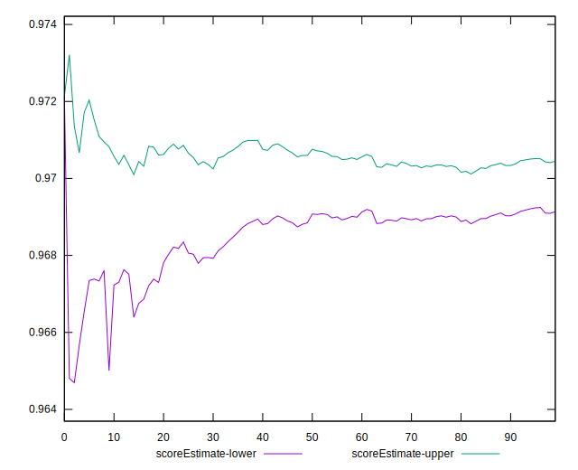
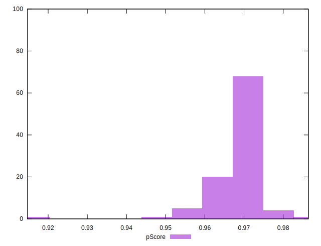
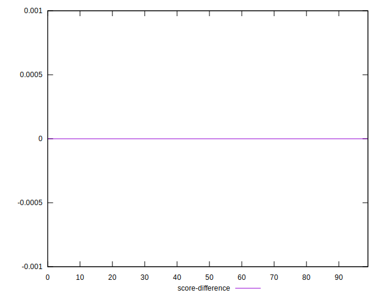
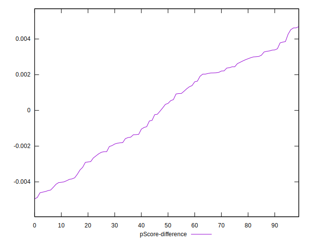
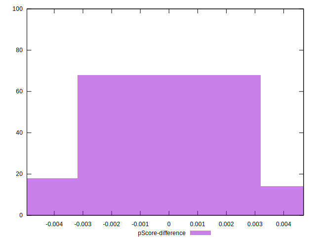

# //speed-index/samples/pages+cached+noadtech

[→ Parent](../..)


## Raw


```yaml
p90min: 2537.6774080632877
p90max: 2799.5480737064086
p90range: 261.8706656431209
p90mean: 2637.0707084023807
p90median: 2631.454330473298
p90stdev: 51.58530205101387
p90skewness: 0.44074699908518244
p90eccentricity: 0.9999999999999997
p90discretization: 1
outlandishness: 1.0079642252662706
confidence: 40.545927915284665
p90confidence: 21.197437740566784

```


## Score


```yaml
p90min: 0.96
p90max: 0.97
p90range: 0.010000000000000009
p90mean: 0.969120879120878
p90median: 0.97
p90stdev: 0.0028316700498297004
p90skewness: -2.910564471397789
p90eccentricity: 1.0000000000000009
p90discretization: 45.5
outlandishness: 0.9991316094034673
confidence: 0.0030188535748219003
p90confidence: 0.001163590154492633

```


## Raw Estimate


## Score Estimate


## P Score


```yaml
p90min: 0.9629961245958452
p90max: 0.9781959172623002
p90range: 0.015199792666454992
p90mean: 0.9699033716535386
p90median: 0.9703381021165041
p90stdev: 0.0031491124272896164
p90skewness: -0.17154944308041278
p90eccentricity: 1.0000000000000002
p90discretization: 1
outlandishness: 0.99753174575955
confidence: 0.002962922612664398
p90confidence: 0.0012940336096025629

```


## Score Difference


```yaml
p90min: 0
p90max: 0
p90range: 0
p90mean: 0
p90median: 0
p90stdev: 0
p90skewness: .nan
p90eccentricity: .nan
p90discretization: 91
outlandishness: .inf
confidence: 6.092792000602807e-18
p90confidence: 0

```


## P Score Difference


```yaml
p90min: -0.004490716389159655
p90max: 0.00426804199230113
p90range: 0.008758758381460785
p90mean: 0.00006225559361404078
p90median: 0.000393674445854586
p90stdev: 0.002590614436211928
p90skewness: -0.2029724523162245
p90eccentricity: 0.9999999999999999
p90discretization: 1
outlandishness: 0.008230826432629276
confidence: 0.0011138170818778927
p90confidence: 0.0010645355564092498

```

