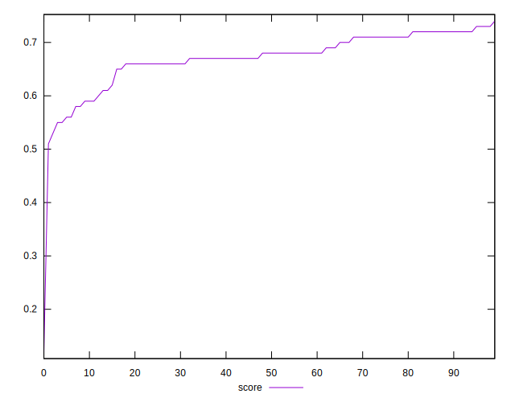
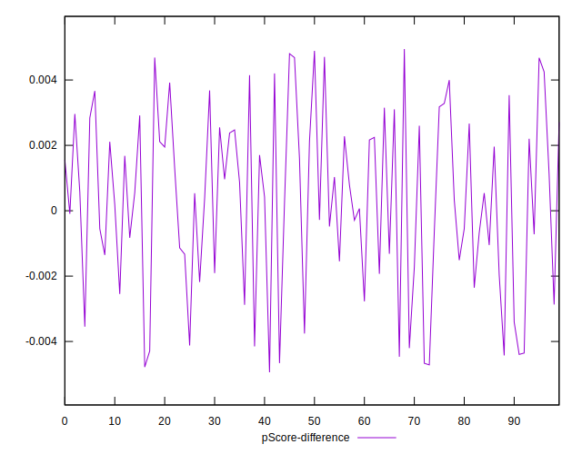
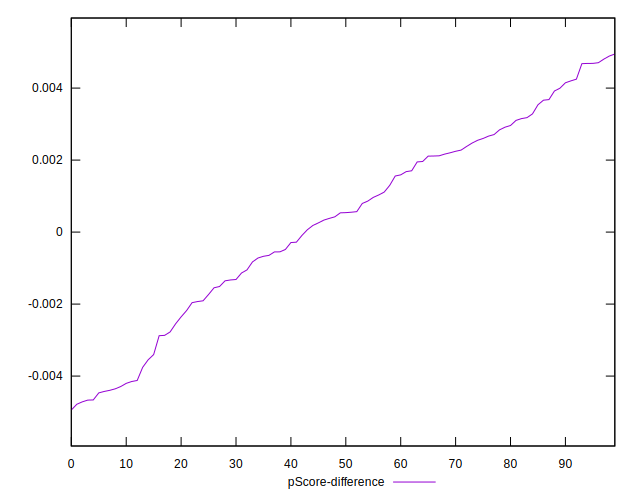

# //speed-index/samples/pages+cached

[→ Parent](../..)


## Raw


```yaml
p90min: 4431.296767679032
p90max: 5278.153349403952
p90range: 846.85658172492
p90mean: 4747.93955675312
p90median: 4776.868721984681
p90stdev: 189.2313045014019
p90skewness: 0.8097362450477947
p90eccentricity: 1
p90discretization: 1
outlandishness: 1.0456587672470672
confidence: 211.19436018949455
p90confidence: 77.7589475344721

```


## Score


```yaml
p90min: 0.59
p90max: 0.74
p90range: 0.15000000000000002
p90mean: 0.6827472527472526
p90median: 0.68
p90stdev: 0.0334159905811355
p90skewness: -0.7752478473135311
p90eccentricity: 0.9999999999999986
p90discretization: 6.5
outlandishness: 0.9535445486635459
confidence: 0.028596969352855828
p90confidence: 0.013731302361717157

```


## Raw Estimate


## Score Estimate


## P Score


```yaml
p90min: 0.588862990118489
p90max: 0.7393276132684055
p90range: 0.1504646231499165
p90mean: 0.683207422382305
p90median: 0.6780913998857094
p90stdev: 0.03370383391075683
p90skewness: -0.8113701280328263
p90eccentricity: 0.9999999999999997
p90discretization: 1
outlandishness: 0.9531402907486826
confidence: 0.02872456030198478
p90confidence: 0.013849582972978336

```


## Score Difference


```yaml
p90min: 0
p90max: 0
p90range: 0
p90mean: 0
p90median: 0
p90stdev: 0
p90skewness: .nan
p90eccentricity: .nan
p90discretization: 91
outlandishness: .inf
confidence: 1.0335413782903705e-17
p90confidence: 0

```


## P Score Difference


```yaml
p90min: -0.004290279219185789
p90max: 0.004946656054490517
p90range: 0.009236935273676306
p90mean: 0.0007934627706406849
p90median: 0.0008608736931644545
p90stdev: 0.0025023704955197653
p90skewness: -0.22535857907062445
p90eccentricity: 0.9999999999999996
p90discretization: 1
outlandishness: 0.15059814352483122
confidence: 0.0011146139556163222
p90confidence: 0.0010282743470253336

```

