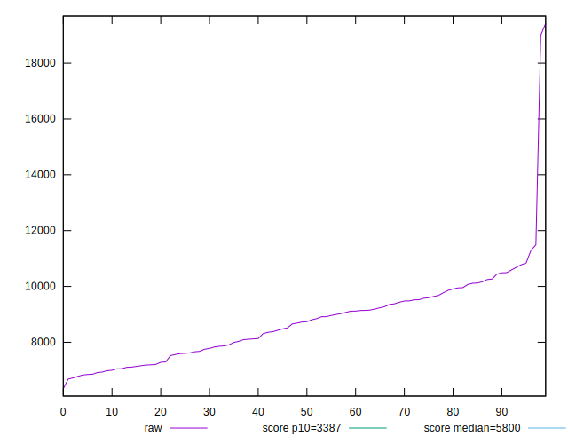
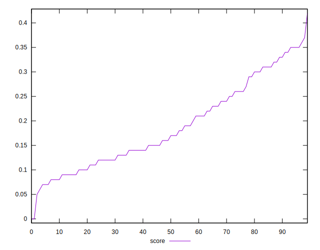

# //speed-index/samples/pages

[→ Parent](../..)


## Raw


```yaml
p90min: 6828.578645889777
p90max: 10777.131304486482
p90range: 3948.5526585967045
p90mean: 8622.208753776335
p90median: 8725.933621935415
p90stdev: 1123.338384338611
p90skewness: 0.0491225590163113
p90eccentricity: 1
p90discretization: 1
outlandishness: 1.0492620700776947
confidence: 755.2539726916184
p90confidence: 461.6023269585239

```


## Score


```yaml
p90min: 0.05
p90max: 0.34
p90range: 0.29000000000000004
p90mean: 0.17934065934065935
p90median: 0.16
p90stdev: 0.08042199411869123
p90skewness: 0.4430338473629419
p90eccentricity: 1.0000000000000009
p90discretization: 3.1379310344827585
outlandishness: 1.1070985351562497
confidence: 0.036929195976026785
p90confidence: 0.033047014275836006

```


## Raw Estimate


## Score Estimate


## P Score


```yaml
p90min: 0.05168672138026953
p90max: 0.3375228160152089
p90range: 0.28583609463493936
p90mean: 0.1796096298422063
p90median: 0.15729617363731668
p90stdev: 0.08091104662946974
p90skewness: 0.4338939711583776
p90eccentricity: 0.9999999999999997
p90discretization: 1
outlandishness: 1.1062603162271014
confidence: 0.03697505798890305
p90confidence: 0.03324797578496591

```


## Score Difference


```yaml
p90min: 0
p90max: 0
p90range: 0
p90mean: 0
p90median: 0
p90stdev: 0
p90skewness: .nan
p90eccentricity: .nan
p90discretization: 91
outlandishness: .inf
confidence: 4.264066145825139e-18
p90confidence: 0

```


## P Score Difference


```yaml
p90min: -0.004217340295212896
p90max: 0.004736109283070777
p90range: 0.008953449578283673
p90mean: 0.0002753435730821322
p90median: 0.00044450119696420876
p90stdev: 0.0024570191801370866
p90skewness: -0.10043961804159979
p90eccentricity: 0.9999999999999988
p90discretization: 1
outlandishness: 0.5897543579781536
confidence: 0.0010792484454420618
p90confidence: 0.0010096385797417292

```

