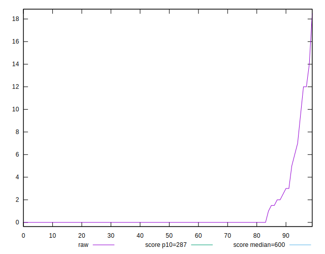

# //total-blocking-time/samples/pages+cached+noadtech+nomedia+nocss

[→ Parent](../..)


## Raw


```yaml
p90min: 0
p90max: 3
p90range: 3
p90mean: 0.14835164835164835
p90median: 0
p90stdev: 0.5421492915843513
p90skewness: 3.735871775570001
p90eccentricity: 1.0000000000000002
p90discretization: 13
outlandishness: 45.89309753086431
confidence: 1.2165978144623775
p90confidence: 0.2227800438792949

```


## Score


```yaml
p90min: 1
p90max: 1
p90range: 0
p90mean: 1
p90median: 1
p90stdev: 0
p90skewness: .nan
p90eccentricity: .nan
p90discretization: 91
outlandishness: 1
confidence: 0
p90confidence: 0

```


## Raw Estimate


## Score Estimate


## P Score


```yaml
p90min: 0.9999999999946796
p90max: 1
p90range: 5.320410778608675e-12
p90mean: 0.9999999999998798
p90median: 1
p90stdev: 7.801416550019852e-13
p90skewness: -6.505697952341562
p90eccentricity: 1.0000000000000018
p90discretization: 18.2
outlandishness: 0.9999999999844735
confidence: 2.9048319305502446e-11
p90confidence: 3.204103649068202e-13

```


## Score Difference


```yaml
p90min: 0
p90max: 0
p90range: 0
p90mean: 0
p90median: 0
p90stdev: 0
p90skewness: .nan
p90eccentricity: .nan
p90discretization: 91
outlandishness: .nan
confidence: 0
p90confidence: 0

```


## P Score Difference


```yaml
p90min: -5.320410778608675e-12
p90max: 0
p90range: 5.320410778608675e-12
p90mean: -1.202237332885848e-13
p90median: 0
p90stdev: 7.801416548865555e-13
p90skewness: -6.505749562312096
p90eccentricity: 0.9999999999999966
p90discretization: 18.2
outlandishness: 4299.750194356723
confidence: 2.904837979309279e-11
p90confidence: 3.2057589082111994e-13

```

