# //total-blocking-time/samples/pages+cached+noadtech+nomedia

[→ Parent](../..)


## Raw


```yaml
p90min: 148
p90max: 210
p90range: 62
p90mean: 167.46153846153845
p90median: 162.99999999999977
p90stdev: 14.79627788977276
p90skewness: 0.8479931613691437
p90eccentricity: 0.9999999999999996
p90discretization: 1.338235294117647
outlandishness: 0.9735262186060517
confidence: 16.684979428904057
p90confidence: 6.080088065596897

```

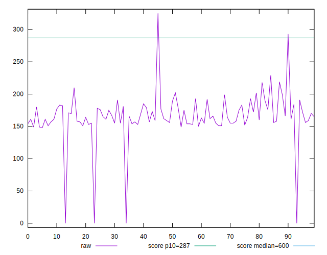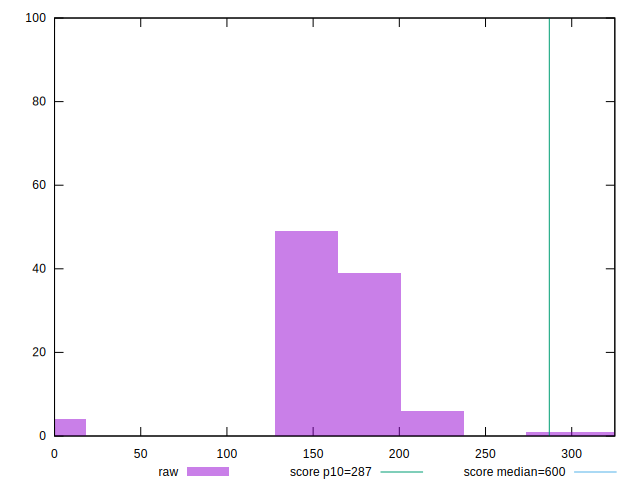
## Score


```yaml
p90min: 0.97
p90max: 0.99
p90range: 0.020000000000000018
p90mean: 0.9861538461538455
p90median: 0.99
p90stdev: 0.005887074829001713
p90skewness: -1.26202634466288
p90eccentricity: 0.9999999999999981
p90discretization: 30.333333333333332
outlandishness: 0.9948272993883869
confidence: 0.006913312813951578
p90confidence: 0.0024191174074819077

```

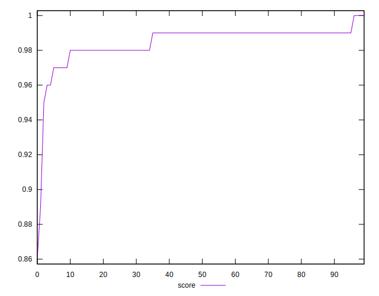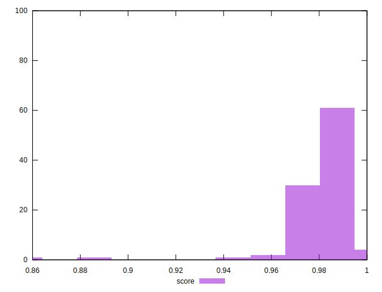
## Raw Estimate

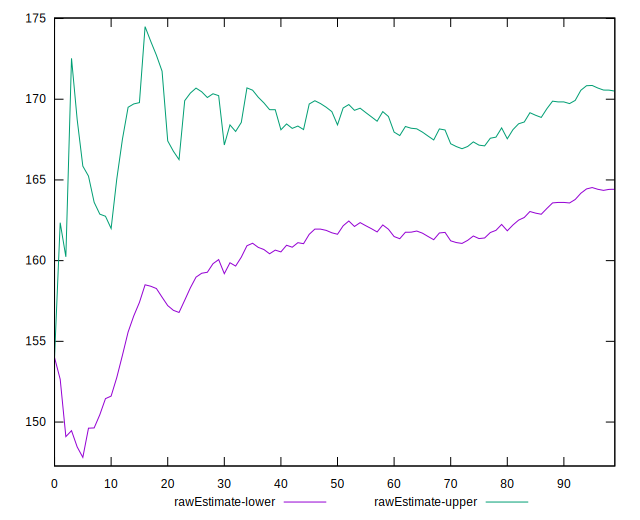
## Score Estimate

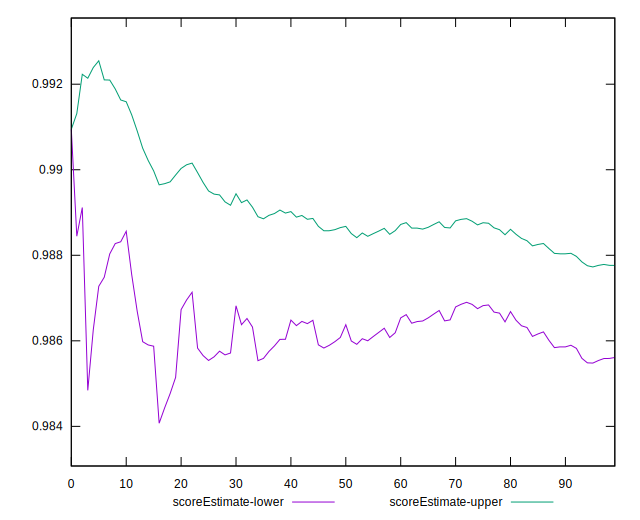
## P Score


```yaml
p90min: 0.9707478784651513
p90max: 1
p90range: 0.029252121534848685
p90mean: 0.9864204116915154
p90median: 0.9885586652661822
p90stdev: 0.005664730262059201
p90skewness: -0.9464245202900913
p90eccentricity: 0.9999999999999996
p90discretization: 1.5423728813559323
outlandishness: 0.9941716676606376
confidence: 0.006901858790383297
p90confidence: 0.002327751554664914

```

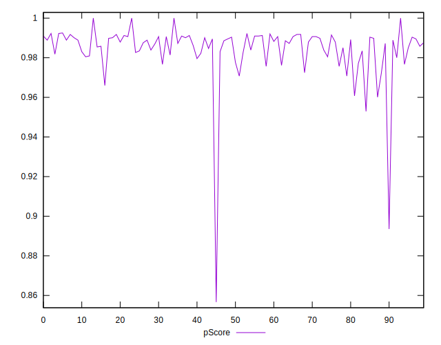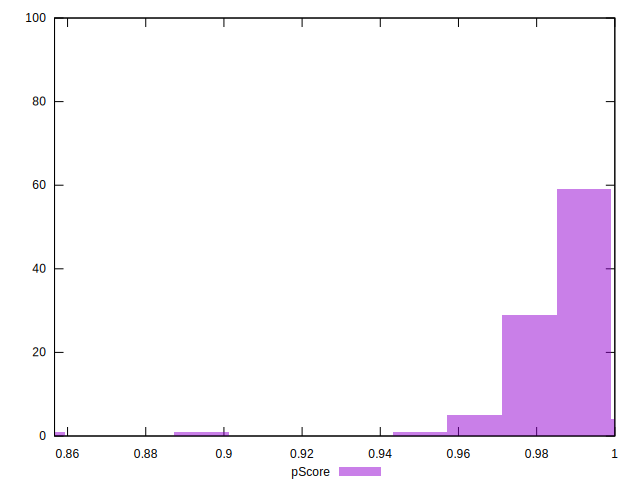
## Score Difference


```yaml
p90min: 0
p90max: 0
p90range: 0
p90mean: 0
p90median: 0
p90stdev: 0
p90skewness: .nan
p90eccentricity: .nan
p90discretization: 91
outlandishness: .inf
confidence: 4.330179641073931e-18
p90confidence: 0

```


## P Score Difference


```yaml
p90min: -0.00384424056065924
p90max: 0.003872915549605782
p90range: 0.007717156110265022
p90mean: 0.00027637002938246365
p90median: 0.00047053485779768867
p90stdev: 0.0019387887769466998
p90skewness: -0.2273283194984868
p90eccentricity: 1
p90discretization: 1.5689655172413792
outlandishness: 0.04462488720526049
confidence: 0.0009024993315839159
p90confidence: 0.0007966872879952265

```

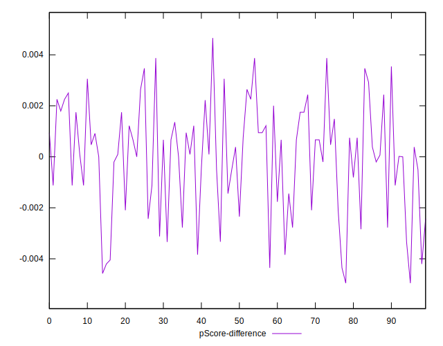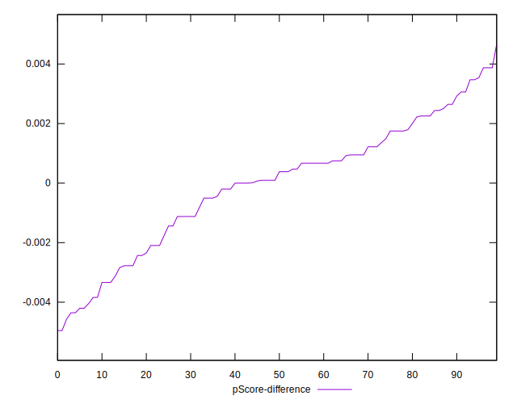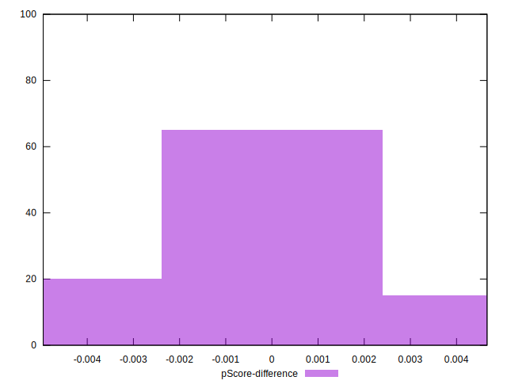