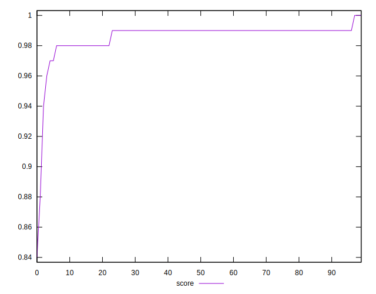

# //total-blocking-time/samples/pages+cached+noadtech

[→ Parent](../..)


## Raw


```yaml
p90min: 148
p90max: 192
p90range: 44
p90mean: 164.9450549450549
p90median: 165
p90stdev: 9.288256365737462
p90skewness: 0.5242090935725573
p90eccentricity: 1.000000000000001
p90discretization: 1.5689655172413792
outlandishness: 1.0022437622038343
confidence: 15.135253064288463
p90confidence: 3.8167312820313555

```


## Score


```yaml
p90min: 0.98
p90max: 0.99
p90range: 0.010000000000000009
p90mean: 0.9881318681318673
p90median: 0.99
p90stdev: 0.0038976149123007087
p90skewness: -1.6070690421380345
p90eccentricity: 0.9999999999999984
p90discretization: 45.5
outlandishness: 0.9932675973740196
confidence: 0.0076509924907337545
p90confidence: 0.001601608329413251

```


## Raw Estimate


## Score Estimate


## P Score


```yaml
p90min: 0.9761557594393407
p90max: 0.9925016364489319
p90range: 0.016345877009591114
p90mean: 0.9873280450884009
p90median: 0.9875677218786949
p90stdev: 0.003311227750144452
p90skewness: -0.9448508476674384
p90eccentricity: 1.0000000000000002
p90discretization: 1.7843137254901962
outlandishness: 0.9936318850374308
confidence: 0.007359267574295947
p90confidence: 0.0013606500551088807

```


## Score Difference


```yaml
p90min: 0
p90max: 0
p90range: 0
p90mean: 0
p90median: 0
p90stdev: 0
p90skewness: .nan
p90eccentricity: .nan
p90discretization: 91
outlandishness: .inf
confidence: 4.330179641073933e-18
p90confidence: 0

```


## P Score Difference


```yaml
p90min: -0.004954404027099013
p90max: 0.003181691797100372
p90range: 0.008136095824199385
p90mean: -0.0011221885590754735
p90median: -0.0011227889720677453
p90stdev: 0.0021149045796779726
p90skewness: -0.0760159176182486
p90eccentricity: 0.9999999999999997
p90discretization: 1.75
outlandishness: 0.3059221167907739
confidence: 0.0010085787533230485
p90confidence: 0.0008690568121638396

```

