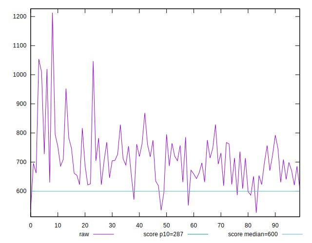
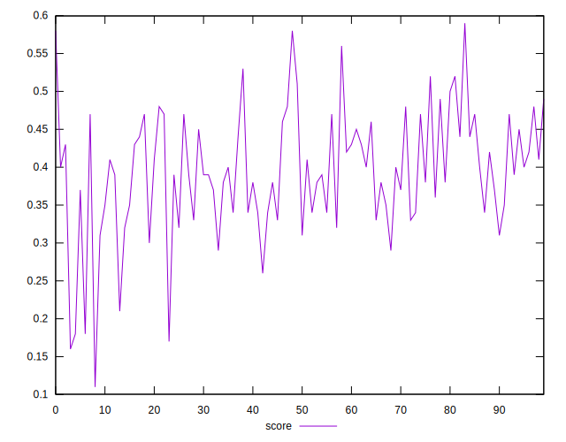
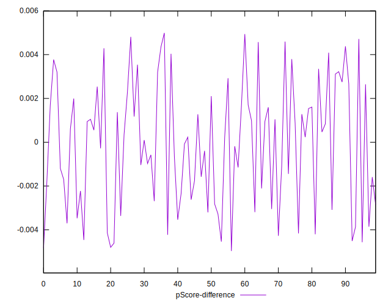

# //total-blocking-time/samples/pages+cached

[→ Parent](../..)


## Raw


```yaml
p90min: 551
p90max: 868.9379999999992
p90range: 317.9379999999992
p90mean: 697.0161593406594
p90median: 698.9110000000001
p90stdev: 65.97048155149922
p90skewness: 0.12307954599477844
p90eccentricity: 1.0000000000000004
p90discretization: 1
outlandishness: 1.047042250617543
confidence: 43.538719766585245
p90confidence: 27.108597212829864

```


## Score


```yaml
p90min: 0.26
p90max: 0.56
p90range: 0.30000000000000004
p90mean: 0.40164835164835144
p90median: 0.4
p90stdev: 0.06331959293087162
p90skewness: 0.1627704208143011
p90eccentricity: 1.0000000000000007
p90discretization: 3.3703703703703702
outlandishness: 0.9578866260149979
confidence: 0.034813264074346484
p90confidence: 0.02601929378222545

```


## Raw Estimate


## Score Estimate


## P Score


```yaml
p90min: 0.2599211669675788
p90max: 0.5588496996057853
p90range: 0.29892853263820657
p90mean: 0.4015550326733897
p90median: 0.3954352251306502
p90stdev: 0.06321724146277814
p90skewness: 0.154395297272884
p90eccentricity: 1.0000000000000002
p90discretization: 1
outlandishness: 0.9578549921466734
confidence: 0.034711153623450564
p90confidence: 0.025977235506199126

```


## Score Difference


```yaml
p90min: 0
p90max: 5.551115123125783e-17
p90range: 5.551115123125783e-17
p90mean: 4.270088556250602e-18
p90median: 0
p90stdev: 1.479202066448897e-17
p90skewness: 3.175426480542932
p90eccentricity: 0.9999999999999977
p90discretization: 45.5
outlandishness: 4.3264000000000005
confidence: 7.977337296109665e-18
p90confidence: 6.078338686135816e-18

```


## P Score Difference


```yaml
p90min: -0.004606744739911461
p90max: 0.004379435669182419
p90range: 0.00898618040909388
p90mean: -0.00026154594437586713
p90median: 0.0000978600758409498
p90stdev: 0.0026633683669068865
p90skewness: -0.03455373370838587
p90eccentricity: 1.0000000000000002
p90discretization: 1
outlandishness: 0.13988803413109485
confidence: 0.001148547449071871
p90confidence: 0.00109443160925707

```

