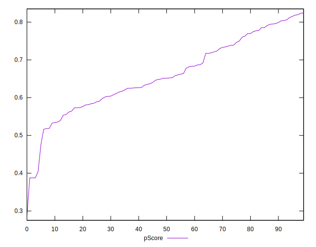
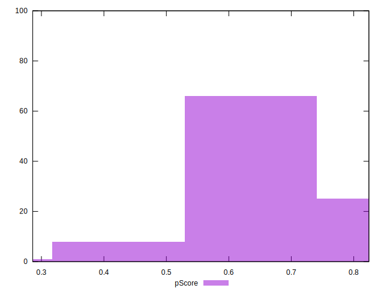
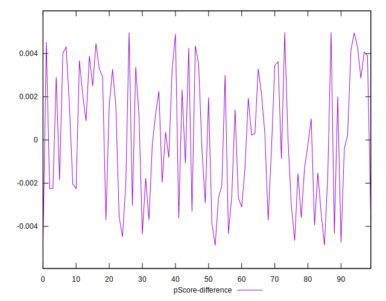
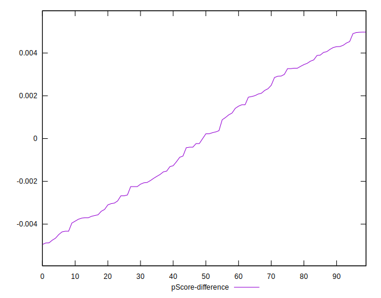

# //total-blocking-time/samples/pages

[→ Parent](../..)


## Raw


```yaml
p90min: 355.5
p90max: 585.9999999999982
p90range: 230.49999999999818
p90mean: 468.00918681318683
p90median: 479.0000000000009
p90stdev: 64.54859710303992
p90skewness: -0.08760593601817515
p90eccentricity: 1.0000000000000002
p90discretization: 1.0340909090909092
outlandishness: 1.0479063746522488
confidence: 34.676394501354594
p90confidence: 26.524316305824755

```


## Score


```yaml
p90min: 0.52
p90max: 0.82
p90range: 0.29999999999999993
p90mean: 0.668131868131868
p90median: 0.65
p90stdev: 0.08599657657270067
p90skewness: 0.1348658840356183
p90eccentricity: 0.9999999999999999
p90discretization: 3.25
outlandishness: 0.9640139196675902
confidence: 0.04311564394173306
p90confidence: 0.03533772228374232

```


## Raw Estimate


## Score Estimate


## P Score


```yaml
p90min: 0.5163639604010101
p90max: 0.818478821112369
p90range: 0.30211486071135896
p90mean: 0.6682804715144208
p90median: 0.6522520192735128
p90stdev: 0.08579424843449916
p90skewness: 0.12897434086861523
p90eccentricity: 1.0000000000000007
p90discretization: 1.0340909090909092
outlandishness: 0.9638810358473623
confidence: 0.043216689373194894
p90confidence: 0.035254581583927136

```


## Score Difference


```yaml
p90min: 0
p90max: 1.1102230246251565e-16
p90range: 1.1102230246251565e-16
p90mean: 2.4400506035717728e-18
p90median: 0
p90stdev: 1.6277167726161674e-17
p90skewness: 6.520925694263961
p90eccentricity: 0.9999999999999962
p90discretization: 45.5
outlandishness: 25.050024999999998
confidence: 1.3616944344102389e-17
p90confidence: 6.688615472811599e-18

```


## P Score Difference


```yaml
p90min: -0.004657108733210236
p90max: 0.004536790847720074
p90range: 0.00919389958093031
p90mean: 0.000052062867552145354
p90median: -0.000004014147833131254
p90stdev: 0.0028557438777672304
p90skewness: 0.012348990880878012
p90eccentricity: 1.0000000000000002
p90discretization: 1.0459770114942528
outlandishness: 3.7396820550452006
confidence: 0.0012138956570926624
p90confidence: 0.0011734825743990231

```

