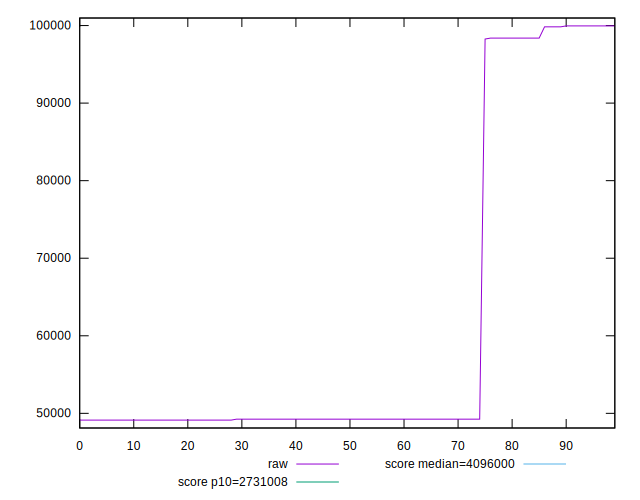

# //total-byte-weight/samples/pages+cached+noadtech+nomedia+nocss

[→ Parent](../..)


## Raw


```yaml
p90min: 49126
p90max: 99955
p90range: 50829
p90mean: 57927.79120879121
p90median: 49248
p90stdev: 18896.725550709132
p90skewness: 1.7040821161424522
p90eccentricity: 1.0000000000000009
p90discretization: 15.166666666666666
outlandishness: 1.1348554108016755
confidence: 8494.650522231284
p90confidence: 7765.044449397712

```


## Score


```yaml
p90min: 1
p90max: 1
p90range: 0
p90mean: 1
p90median: 1
p90stdev: 0
p90skewness: .nan
p90eccentricity: .nan
p90discretization: 91
outlandishness: 1
confidence: 0
p90confidence: 0

```


## Raw Estimate


## Score Estimate


## P Score


```yaml
p90min: 0
p90max: 0
p90range: 0
p90mean: 0
p90median: 0
p90stdev: 0
p90skewness: .nan
p90eccentricity: .nan
p90discretization: 91
outlandishness: .nan
confidence: 0
p90confidence: 0

```


## Score Difference


```yaml
p90min: -1
p90max: -1
p90range: 0
p90mean: -1
p90median: -1
p90stdev: 0
p90skewness: .nan
p90eccentricity: .nan
p90discretization: 91
outlandishness: 1
confidence: 0
p90confidence: 0

```


## P Score Difference


```yaml
p90min: -1
p90max: -1
p90range: 0
p90mean: -1
p90median: -1
p90stdev: 0
p90skewness: .nan
p90eccentricity: .nan
p90discretization: 91
outlandishness: 1
confidence: 0
p90confidence: 0

```

