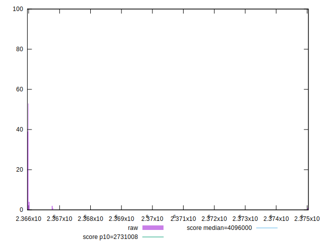
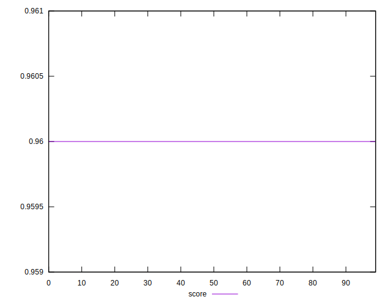
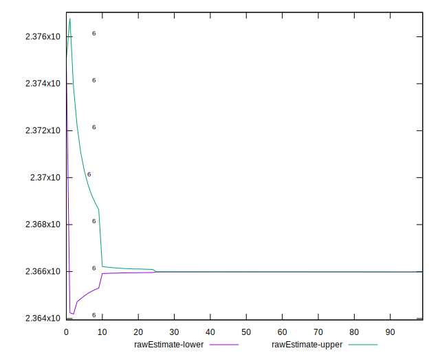

# //total-byte-weight/samples/pages

[→ Parent](../..)


## Raw


```yaml
p90min: 2365966
p90max: 2366022
p90range: 56
p90mean: 2365984.208791209
p90median: 2365982
p90stdev: 10.713569995818723
p90skewness: 0.8994141914252959
p90eccentricity: 1.0000000000000009
p90discretization: 2.676470588235294
outlandishness: 1.0000954054555402
confidence: 356.2159232329577
p90confidence: 4.402421308681369

```


## Score


```yaml
p90min: 0.96
p90max: 0.96
p90range: 0
p90mean: 0.9599999999999989
p90median: 0.96
p90stdev: 1.1102230246251565e-15
p90skewness: 1
p90eccentricity: 1
p90discretization: 91
outlandishness: 0.9999999999999991
confidence: 6.661338147750939e-16
p90confidence: 4.440892098500626e-16

```


## Raw Estimate


## Score Estimate


## P Score


```yaml
p90min: 0
p90max: 0
p90range: 0
p90mean: 0
p90median: 0
p90stdev: 0
p90skewness: .nan
p90eccentricity: .nan
p90discretization: 91
outlandishness: .nan
confidence: 0
p90confidence: 0

```


## Score Difference


```yaml
p90min: -0.96
p90max: -0.96
p90range: 0
p90mean: -0.9599999999999989
p90median: -0.96
p90stdev: 1.1102230246251565e-15
p90skewness: -1
p90eccentricity: 1
p90discretization: 91
outlandishness: 0.9999999999999991
confidence: 6.661338147750939e-16
p90confidence: 4.440892098500626e-16

```


## P Score Difference


```yaml
p90min: -0.96
p90max: -0.96
p90range: 0
p90mean: -0.9599999999999989
p90median: -0.96
p90stdev: 1.1102230246251565e-15
p90skewness: -1
p90eccentricity: 1
p90discretization: 91
outlandishness: 0.9999999999999991
confidence: 6.661338147750939e-16
p90confidence: 4.440892098500626e-16

```

