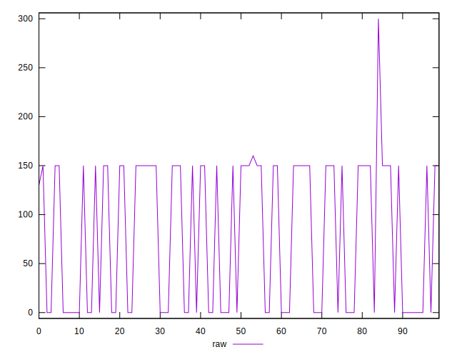
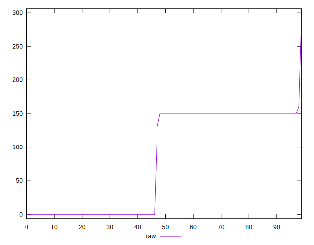
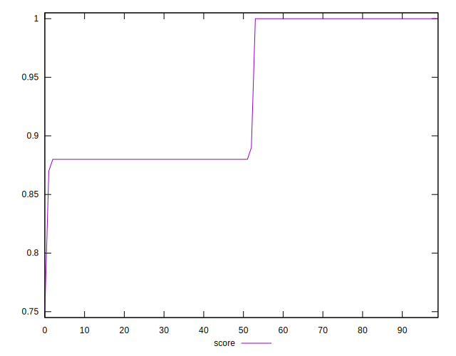
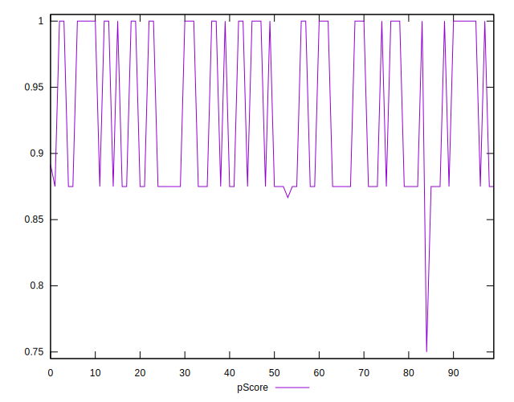
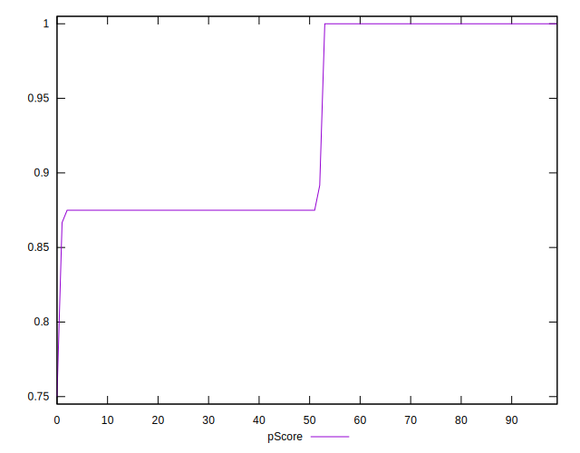

# //unminified-css/samples/pages+cached

[→ Parent](../..)


## Raw


```yaml
p90min: 0
p90max: 160
p90range: 160
p90mean: 85.6043956043956
p90median: 150
p90stdev: 74.17248669740324
p90skewness: -0.2858417265261568
p90eccentricity: 1.0000000000000009
p90discretization: 22.75
outlandishness: 0.8931099185783427
confidence: 30.43992547031715
p90confidence: 30.47896602943908

```


## Score


```yaml
p90min: 0.88
p90max: 1
p90range: 0.12
p90mean: 0.9328571428571427
p90median: 0.88
p90stdev: 0.05947177212551201
p90skewness: 0.24267287053026876
p90eccentricity: 0.9999999999999988
p90discretization: 30.333333333333332
outlandishness: 1.0048143564042968
confidence: 0.02448932450075425
p90confidence: 0.024438146852470144

```


## Raw Estimate


## Score Estimate


## P Score


```yaml
p90min: 0.8666666666666667
p90max: 1
p90range: 0.1333333333333333
p90mean: 0.9286630036630036
p90median: 0.875
p90stdev: 0.06181040558116935
p90skewness: 0.2858417265261554
p90eccentricity: 1.0000000000000009
p90discretization: 22.75
outlandishness: 1.0084607752132657
confidence: 0.025366604558597627
p90confidence: 0.025399138357866002

```


## Score Difference


```yaml
p90min: 0
p90max: 0
p90range: 0
p90mean: 0
p90median: 0
p90stdev: 0
p90skewness: .nan
p90eccentricity: .nan
p90discretization: 91
outlandishness: .nan
confidence: 0
p90confidence: 0

```


## P Score Difference


```yaml
p90min: -0.0050000000000000044
p90max: 0
p90range: 0.0050000000000000044
p90mean: -0.002783882783882786
p90median: -0.0050000000000000044
p90stdev: 0.0024715097620614216
p90skewness: 0.23194610224024742
p90eccentricity: 0.9999999999999996
p90discretization: 30.333333333333332
outlandishness: 0.8172397896468148
confidence: 0.000984306150267713
p90confidence: 0.0010155930511890785

```

