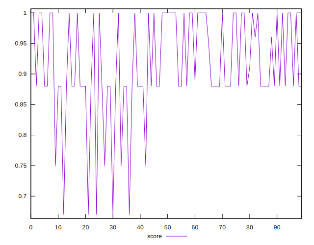
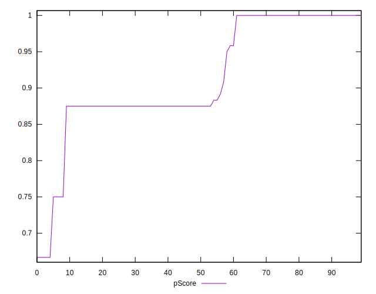
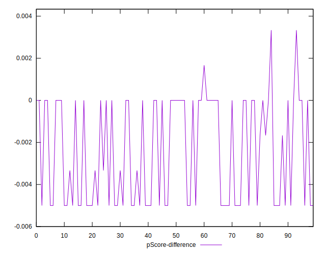

# //unminified-css/samples/pages

[→ Parent](../..)


## Raw


```yaml
p90min: 0
p90max: 150
p90range: 150
p90mean: 81.64835164835165
p90median: 140
p90stdev: 72.82771686272189
p90skewness: -0.18202165964190797
p90eccentricity: 0.9999999999999999
p90discretization: 13
outlandishness: 1.7756728232457624
confidence: 44.315232119626984
p90confidence: 29.926373067632625

```


## Score


```yaml
p90min: 0.88
p90max: 1
p90range: 0.12
p90mean: 0.9343956043956041
p90median: 0.88
p90stdev: 0.058464017133275925
p90skewness: 0.1860142030282241
p90eccentricity: 0.9999999999999984
p90discretization: 15.166666666666666
outlandishness: 0.9564025688272202
confidence: 0.034041499487416305
p90confidence: 0.02402404006514236

```


## Raw Estimate


## Score Estimate


## P Score


```yaml
p90min: 0.875
p90max: 1
p90range: 0.125
p90mean: 0.931959706959707
p90median: 0.8833333333333333
p90stdev: 0.0606897640522682
p90skewness: 0.1820216596419074
p90eccentricity: 1.0000000000000004
p90discretization: 13
outlandishness: 0.9564002034665406
confidence: 0.03456018881453371
p90confidence: 0.024938644223027273

```


## Score Difference


```yaml
p90min: 0
p90max: 0
p90range: 0
p90mean: 0
p90median: 0
p90stdev: 0
p90skewness: .nan
p90eccentricity: .nan
p90discretization: 91
outlandishness: .inf
confidence: 4.330179641073933e-18
p90confidence: 0

```


## P Score Difference


```yaml
p90min: -0.0050000000000000044
p90max: 0
p90range: 0.0050000000000000044
p90mean: -0.002380952380952386
p90median: -0.0016666666666665941
p90stdev: 0.002397379230743151
p90skewness: -0.08771049077805466
p90eccentricity: 1.0000000000000009
p90discretization: 18.2
outlandishness: 1.002001000000001
confidence: 0.0009962025621772091
p90confidence: 0.0009851313254684432

```

