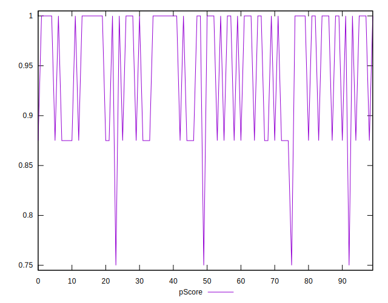
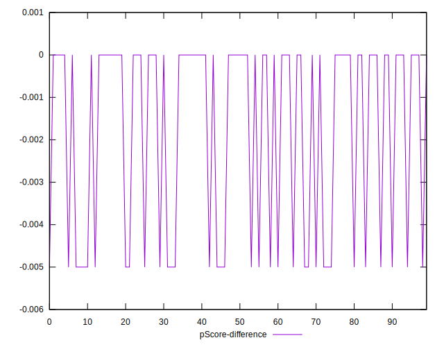

# //unminified-javascript/samples/pages+cached+noadtech+nomedia+nocss

[→ Parent](../..)


## Raw


```yaml
p90min: 0
p90max: 150
p90range: 150
p90mean: 49.45054945054945
p90median: 0
p90stdev: 70.51400978969491
p90skewness: 0.724663102428884
p90eccentricity: 0.9999999999999983
p90discretization: 45.5
outlandishness: 1.7012854444444445
confidence: 33.525698148538154
p90confidence: 28.975624314007106

```


## Score


```yaml
p90min: 0.88
p90max: 1
p90range: 0.12
p90mean: 0.9604395604395604
p90median: 1
p90stdev: 0.056411207831755864
p90skewness: -0.7246631024288887
p90eccentricity: 1.0000000000000002
p90discretization: 45.5
outlandishness: 0.9742638627211744
confidence: 0.02725971009154482
p90confidence: 0.023180499451205705

```


## Raw Estimate


## Score Estimate


## P Score


```yaml
p90min: 0.875
p90max: 1
p90range: 0.125
p90mean: 0.9587912087912088
p90median: 1
p90stdev: 0.05876167482474573
p90skewness: -0.7246631024288873
p90eccentricity: 0.9999999999999981
p90discretization: 45.5
outlandishness: 0.9740106339438922
confidence: 0.027938081790448432
p90confidence: 0.024146353595005943

```


## Score Difference


```yaml
p90min: 0
p90max: 0
p90range: 0
p90mean: 0
p90median: 0
p90stdev: 0
p90skewness: .nan
p90eccentricity: .nan
p90discretization: 91
outlandishness: .nan
confidence: 0
p90confidence: 0

```


## P Score Difference


```yaml
p90min: -0.0050000000000000044
p90max: 0
p90range: 0.0050000000000000044
p90mean: -0.0014285714285714299
p90median: 0
p90stdev: 0.002258769757263129
p90skewness: -0.9486832980505167
p90eccentricity: 1.0000000000000016
p90discretization: 45.5
outlandishness: 1.5006249999999997
confidence: 0.0009348432391090592
p90confidence: 0.000928173906057777

```

