# //unminified-javascript/samples/pages+cached

[→ Parent](../..)


## Raw


```yaml
p90min: 0
p90max: 150
p90range: 150
p90mean: 51.75824175824176
p90median: 0
p90stdev: 70.67326781550267
p90skewness: 0.6464677482668995
p90eccentricity: 1.0000000000000029
p90discretization: 22.75
outlandishness: 1.5194357057532195
confidence: 31.235603576384804
p90confidence: 29.041066638710518

```

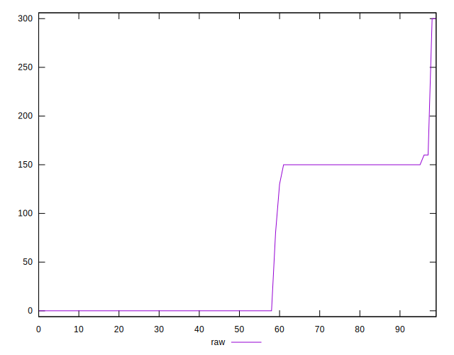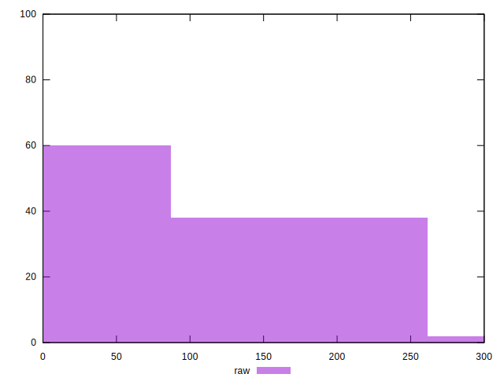
## Score


```yaml
p90min: 0.88
p90max: 1
p90range: 0.12
p90mean: 0.9584615384615388
p90median: 1
p90stdev: 0.05664470096208195
p90skewness: -0.6412602257389373
p90eccentricity: 0.9999999999999986
p90discretization: 22.75
outlandishness: 0.9795280128513966
confidence: 0.02527073921922951
p90confidence: 0.02327644647286009

```

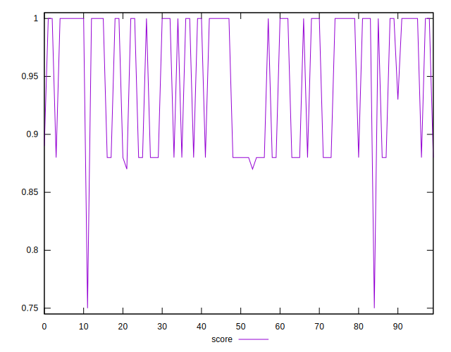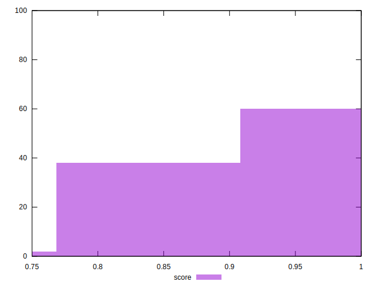
## Raw Estimate

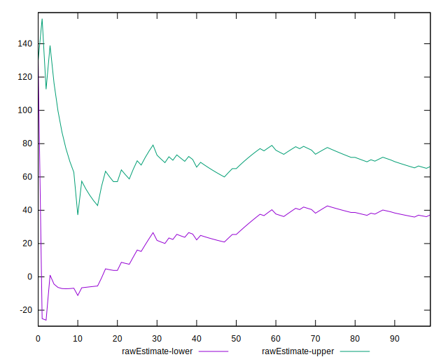
## Score Estimate

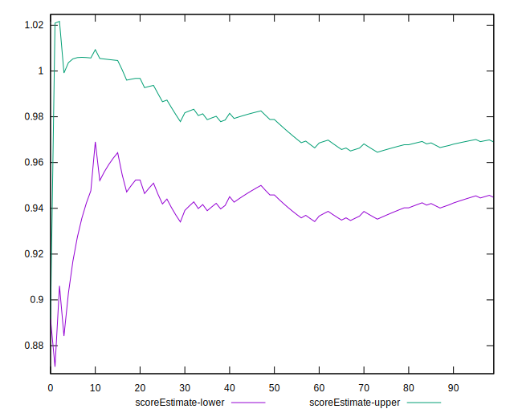
## P Score


```yaml
p90min: 0.875
p90max: 1
p90range: 0.125
p90mean: 0.9568681318681319
p90median: 1
p90stdev: 0.05889438984625227
p90skewness: -0.6464677482668988
p90eccentricity: 1.000000000000002
p90discretization: 22.75
outlandishness: 0.9791357239430846
confidence: 0.026029669646987275
p90confidence: 0.02420088886559202

```

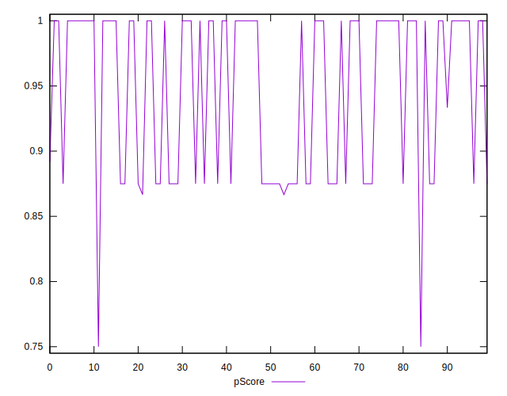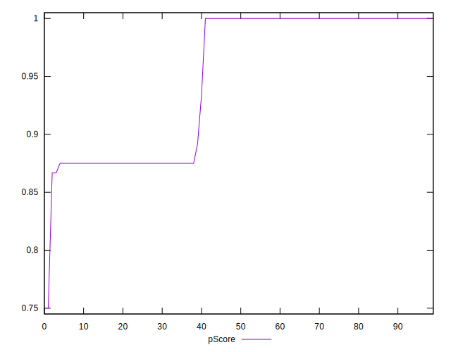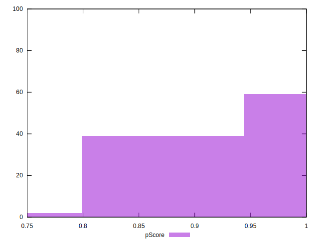
## Score Difference


```yaml
p90min: 0
p90max: 0
p90range: 0
p90mean: 0
p90median: 0
p90stdev: 0
p90skewness: .nan
p90eccentricity: .nan
p90discretization: 91
outlandishness: .nan
confidence: 0
p90confidence: 0

```


## P Score Difference


```yaml
p90min: -0.0050000000000000044
p90max: 0
p90range: 0.0050000000000000044
p90mean: -0.0016117216117216124
p90median: 0
p90stdev: 0.00231059762460222
p90skewness: -0.7518329375762611
p90eccentricity: 1.0000000000000018
p90discretization: 30.333333333333332
outlandishness: 1.201514927685952
confidence: 0.0009593818496502387
p90confidence: 0.0009494710187520146

```

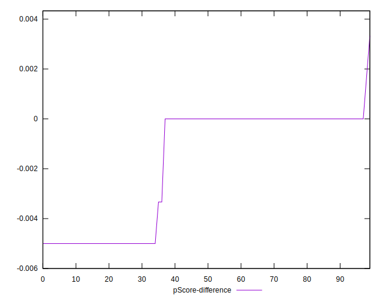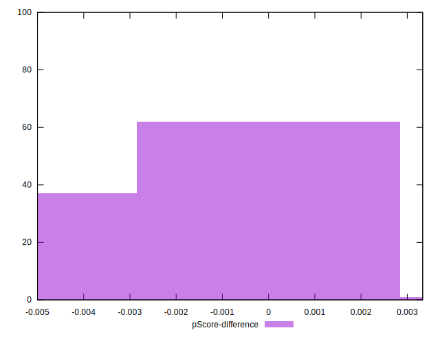