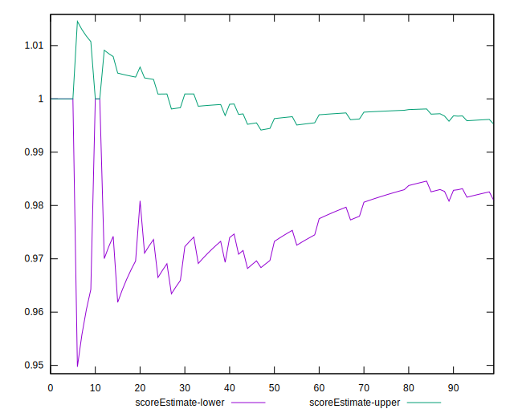
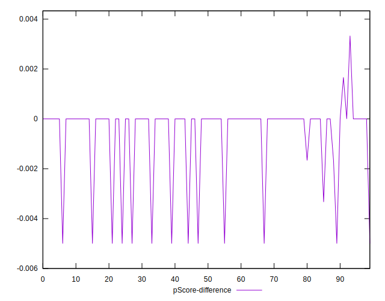

# //unminified-javascript/samples/pages

[→ Parent](../..)


## Raw


```yaml
p90min: 0
p90max: 150
p90range: 150
p90mean: 14.285714285714286
p90median: 0
p90stdev: 41.77761262683022
p90skewness: 2.7289298001425895
p90eccentricity: 1.000000000000003
p90discretization: 13
outlandishness: 4.293184
confidence: 25.716161557165712
p90confidence: 17.167260971564577

```


## Score


```yaml
p90min: 0.88
p90max: 1
p90range: 0.12
p90mean: 0.9884615384615384
p90median: 1
p90stdev: 0.03370600353877941
p90skewness: -2.7303806478966726
p90eccentricity: 1.0000000000000018
p90discretization: 15.166666666666666
outlandishness: 0.9749449287650073
confidence: 0.02097069874355806
p90confidence: 0.013850474516753364

```


## Raw Estimate


## Score Estimate


## P Score


```yaml
p90min: 0.875
p90max: 1
p90range: 0.125
p90mean: 0.988095238095238
p90median: 1
p90stdev: 0.03481467718902519
p90skewness: -2.728929800142592
p90eccentricity: 1.0000000000000024
p90discretization: 13
outlandishness: 0.9743354890404992
confidence: 0.021430134630971542
p90confidence: 0.014306050809637094

```


## Score Difference


```yaml
p90min: 0
p90max: 0
p90range: 0
p90mean: 0
p90median: 0
p90stdev: 0
p90skewness: .nan
p90eccentricity: .nan
p90discretization: 91
outlandishness: .nan
confidence: 0
p90confidence: 0

```


## P Score Difference


```yaml
p90min: -0.0050000000000000044
p90max: 0.0033333333333332993
p90range: 0.008333333333333304
p90mean: -0.0002380952380952375
p90median: 0
p90stdev: 0.0011738769493745069
p90skewness: -2.8113515931843738
p90eccentricity: 1.000000000000004
p90discretization: 13
outlandishness: 7.840000000000036
confidence: 0.0006914103042314976
p90confidence: 0.00048236963941482335

```

